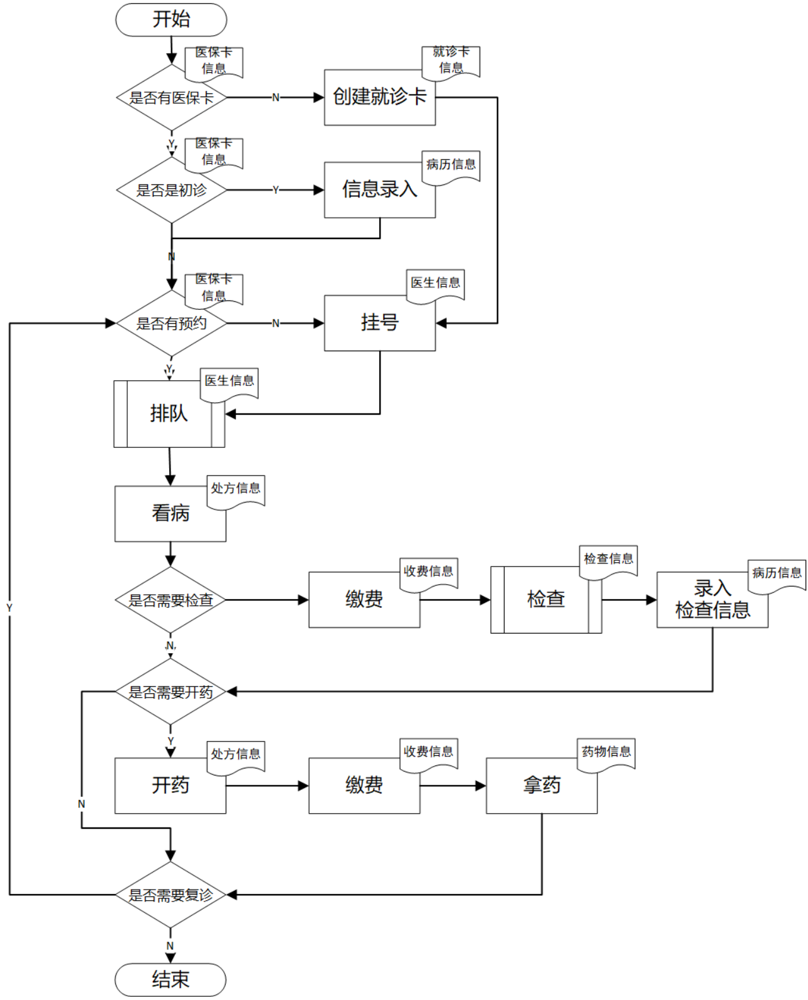

# Hospital Outpatient Information Management System (HIS-OP)

[中文](README.md) | **English**

A comprehensive hospital information management system for small and medium-sized hospitals, built with **Vue 3 + FastAPI**, covering core business flows including **outpatient, inpatient, pharmacy, lab, physical examination, and billing**.

[](LICENSE)
[](https://vuejs.org/)
[](https://fastapi.tiangolo.com/)
[](https://www.python.org/)

---

## 📊 Project Scale

| Metric | Count |
|:------:|:-----:|
| Business Modules | **75** backend routers |
| API Endpoints | **541** RESTful APIs |
| Database Tables | **139** business tables |
| Frontend Pages | **143** Vue pages |
| User Roles | **8** (admin/director/doctor/nurse/cashier/pharmacist/guide/patient) |

---

## 🌟 Features

### Implemented Core Business (9 Domains / 40+ Modules)

- **Outpatient Management** — Smart Triage, Appointment, Walk-in Registration, Check-in, Queue Management, Triage Desk, Patrol Records, Breach Records, Billing, Invoice, Daily Settlement
- **Doctor Workstation** — Scheduling, EMR, Prescription, Lab Orders, Attendance, MDT Consultation, Clinical Pathway
- **Pharmacy** — Drug Management, Consumables, Audit & Dispense, Stock Alert, Stock Check, Purchase, Prescription Review, ADR Monitoring
- **Inpatient Management** — Ward & Bed, Admission, Inpatient Orders, Nursing Station, Inpatient Charges, Discharge Settlement
- **Electronic Medical Record (EMR)** — Templates, Structured Records, Progress Notes, Ward Rounds, Quality Control, CA Digital Signature
- **Lab & Physical Exam** — Lab Orders, Results, Exam Packages, Appointments, Records, Reports
- **Surgery** — Surgery Application, Scheduling, Anesthesia Records
- **Patient Services** — Health Records, EMR Query, Prescription Query, Prepaid Account, Two-way Referral, Follow-up, Satisfaction Survey
- **System Platform** — User & Permissions, Operation Logs (auto-recorded by middleware), Dictionary, Parameters, Messages, Notices, Backup, Adverse Events (with RCA root-cause analysis), Slot Pool, Reports, Department Performance

### HIS Completion Modules (4 batches delivered 2026-08, zero seed data — all user-entered)

- **Prescription Review Rule Engine** — 5 rule types (interaction / contraindication / dose / duplicate / allergy-keyword); severity-3 rules **block both prescribing and dispensing**
- **Insurance Catalog Mapping** — local items ↔ insurance codes with category/self-pay ratio/price limit; template download + batch import
- **CSSD** — full instrument-pack state machine (0-6) with BD-test and biological-monitor gates
- **PIVAS** — batch flow with mandatory **dual-person check** (dispenser cannot verify own batch)
- **ICU/PACU Scoring** — server-side APACHE II / SOFA / GCS / Aldrete / Steward with discharge criteria
- **Clinical Pathway Enrollment** — enroll / progress / 4-type variation / completion-gated exit
- **MDRO Isolation / Hand Hygiene / Notifiable Disease Reporting / HQMS Indicators** — infection-control suite with auto disease-class inference and report state machine
- **Archive Borrow Approval** — request → approve/reject → return-and-reset workflow with approval desk
- **ICD Coding Workbench** — dictionary-validated binding of diagnoses/operations, single primary code, coverage stats
- **Department Performance** — (workload − cost) × coefficient computed server-side; draft → submit → audit
- **Perioperative Antibiotic Compliance / Green-channel Billing Closure / Pay-date Settlement / Scrap Batch Ledger**

### Planned Modules

| Module | Description |
|:------:|:------------|
| Medical Insurance Gateway | Real-time settlement uplink, e-credentials (catalog mapping already delivered) |
| PACS/RIS | Medical imaging storage, viewing, reports |
| Closed-loop Orders | Order → Dispense → Execute → Bill loop |
| CDSS Deep Integration | Rule engine delivered; plan expert knowledge base + renal dose adjustment |
| DRG/DIP Auto-grouper | Manual grouping & profit analysis delivered; plan CHS-DRG grouper |
| Internet Hospital | Online consultation, follow-up prescription |

> See [doc/todos.md](doc/todos.md) for the full roadmap and [doc/his-feature-gap-analysis.md](doc/his-feature-gap-analysis.md) for the HIS gap analysis and delivery record.

---

## 🏗 Architecture

```
┌─────────────────────────────────────────────────────────────┐
│                  Frontend (Browser)                          │
│        Vue 3 · Element Plus · Vuex · Vue Router · Rspack    │
├─────────────────────────────────────────────────────────────┤
│                  Application (FastAPI)                       │
│   34 routers · 247 APIs · JWT Auth · Operation Log MW        │
├─────────────────────────────────────────────────────────────┤
│                  Data Layer                                  │
│             SQLite (dev) / PostgreSQL (prod)                 │
│                   SQLAlchemy ORM · Alembic                   │
└─────────────────────────────────────────────────────────────┘
```

### Tech Stack

| Layer | Technologies |
|:-----:|:-------------|
| Frontend | Vue 3.4+ / Element Plus 2.x / Vuex 4 / Vue Router 4 / Axios / Rspack |
| Backend | FastAPI 0.111+ / SQLAlchemy 2.x / Pydantic 2.x / Alembic |
| Database | SQLite (dev) / PostgreSQL (prod recommended) |
| Containerization | Docker / Docker Compose |
| Code Quality | ruff (Python) / Prettier (JavaScript) |
| Testing | pytest (backend API testing) |
| Security | bcrypt password hashing, JWT sessions, operation log auditing |

---

## 🚀 Quick Start

### Requirements

| Component | Version |
|:---------:|:-------:|
| Node.js | ≥ 16 |
| Python | ≥ 3.10 |
| Database | SQLite included (no install needed) |

### 1. Clone

```bash
git clone https://github.com/Palpitate-xus/hoimsystem.git
cd hoimsystem
```

### 2. Start Backend

```bash
cd fastapi_be

# Create virtualenv
python -m venv venv
source venv/bin/activate    # Linux/Mac
# venv\Scripts\activate     # Windows

# Install dependencies
pip install -r requirements.txt

# Run (auto-creates tables on first launch)
python -m uvicorn app.main:app --reload --host 0.0.0.0 --port 8000
```

Visit http://localhost:8000/docs for the auto-generated Swagger UI.

### 3. Start Frontend

```bash
cd vue3-new-ui

# Install dependencies
npm install --legacy-peer-deps

# Dev mode (port 8091)
npm run serve:rspack

# Production build
npm run build
```

### 4. Access

- Frontend: http://localhost:8091
- Backend API: http://localhost:8000/api
- API Docs: http://localhost:8000/docs

### 5. Docker (recommended for production)

```bash
docker-compose up -d
```

See [doc/deployDoc.md](doc/deployDoc.md) for detailed deployment instructions (Nginx, HTTPS, Systemd).

---

## 🔑 Default Accounts

| Role | Username | Password | Note |
|:----:|:--------:|:--------:|:----:|
| Admin | `admin` | `admin123` | Full permissions |
| Super Admin | `super01` | `123456` | Highest permissions |
| Director | `director01` | `123456` | Department management |
| Doctor | `doctor1` | `doctor123` | Regular doctor |
| Nurse | `nurse01` | `123456` | Nursing work |
| Cashier | `cashier01` | `123456` | Cashier desk |
| Pharmacist | `pharmacist01` | `123456` | Pharmacy work |
| Guide | `guide01` | `123456` | Guidance desk |
| Lab Technician | `lab01` | `123456` | Laboratory work |
| Registrar | `registrar01` | `123456` | Registration service |
| Patient | `patient1` | `123456` | Patient self-service |

> ⚠️ **Production deployment**: change default passwords and set a strong random `SECRET_KEY` in `.env` (use `openssl rand -base64 32`).

---

## 👥 Roles

| Role | Permissions |
|:----:|:------------|
| **Admin** | Full system management |
| **Director** | Department management, scheduling, prescription review |
| **Doctor** | EMR writing, prescription, lab orders |
| **Nurse** | Triage, vital signs, nursing, follow-up |
| **Cashier** | Walk-in registration, billing, daily settlement |
| **Pharmacist** | Prescription audit, dispense, inventory |
| **Guide** | Triage desk, smart triage, queue |
| **Patient** | Self-service: appointments, billing, records |

---

## 📚 Documentation

| Document | Description |
|:--------:|:------------|
| [Doc Index](doc/README.md) | Navigation for all docs |
| [Architecture](doc/architecture.md) | System architecture & design decisions |
| [Requirements](doc/demandDoc.md) | Functional & non-functional requirements |
| [API Doc](doc/apiDoc.md) | core API definitions (541 total in RBAC matrix) |
| [Database Doc](doc/databaseDoc.md) | 61 tables and ER relationships |
| [Deployment](doc/deployDoc.md) | Dev/prod/Docker deployment guide |
| [User Manual](doc/user-manual.md) | Role-based operation guide |
| [Roadmap](doc/todos.md) | Completed & planned modules |
| [Security](SECURITY.md) | Security policy |
| [Contributing](CONTRIBUTING.md) | Code style & PR workflow |
| [Changelog](CHANGELOG.md) | Version history |

---

<a id="performance-benchmark"></a>

## ⚡ Performance Benchmark

### Current Status

> **Baseline pending rerun (2026-09-03):** Previously published throughput, latency, failure-rate, and concurrency figures came from the legacy harness. That server shared one SQLite connection through `StaticPool`; the mixed workload used pre-generated `admin` tokens for writes that require patient or doctor identities and counted results by HTTP status alone, so responses with `code != 200` could be counted as successes. The legacy figures are not comparable with the current implementation and must not be used as a performance baseline, capacity recommendation, or SLA. HTTP 401 in the legacy results represented authentication failures, not connection-pool exhaustion.

### Corrected Benchmark Configuration

| Item | Configuration |
|:----:|:-------------|
| Server | FastAPI + Uvicorn, 1 worker |
| Database | Dedicated SQLite file at `fastapi_be/benchmark.db` |
| Initialization | Rebuilds the dedicated benchmark database and seeds benchmark identities and business data; ambient `DATABASE_URL` is ignored |
| Connections | SQLAlchemy `QueuePool`; overlapping sessions receive distinct DBAPI connections |
| Authentication | Calls `/api/login` before each run and validates `sub`, `iat`, and `exp`; the Locust run stops on invalid credentials or tokens |
| Roles | Admin for queries, patient for appointments, doctor for prescriptions |
| Write targets | Loads live schedules, patients, and available drugs before the run and builds consistent, non-duplicate appointment requests |
| Mixed workload | Approximately 96.2% queries and 3.8% writes by task weight: eight query operations and two write operations |
| Success rule | Appointment and prescription writes require HTTP 2xx and response-body `code == 200` |
| Tool | Locust 2.44.4, single-process headless mode |
| Duration | 30 seconds per run, with no explicit warm-up |

`locust_readonly_pool.py` does not mutate business data, but it is not GET-only: it also uses `POST /api/log/getList` as a query. The corrected SQLite setup permits multiple database connections, while SQLite still serializes competing writes at the file-lock level. PostgreSQL has not been measured under the same commit, hardware, data volume, and workload, so no concrete throughput, latency, or concurrency figures should be extrapolated from SQLite.

### Reproducing the Tests

`init_benchmark_data.py` drops and recreates tables only in the repository's dedicated `fastapi_be/benchmark.db`; it never uses another database from the environment. Reinitialize before every benchmark round.

```bash
# Terminal 1: initialize and start the benchmark server
cd fastapi_benchmark
export SECRET_KEY="benchmark-only-local-secret-at-least-32-bytes"
python init_benchmark_data.py
uvicorn run_benchmark:app --host 0.0.0.0 --port 8000

# Terminal 2: choose one scenario (add localhost to NO_PROXY if an HTTP proxy is configured)
cd fastapi_benchmark
mkdir -p benchmark_results
locust -f locust_final.py --headless -u 50 -r 25 -t 30s \
    --host http://localhost:8000 --csv=benchmark_results/mixed_50u \
    --exit-code-on-error 1

# To run the read-only scenario, first stop Terminal 1, reinitialize, and restart the server
locust -f locust_readonly_pool.py --headless -u 50 -r 25 -t 30s \
    --host http://localhost:8000 --csv=benchmark_results/readonly_50u \
    --exit-code-on-error 1
```

The initializer creates admin, doctor, and patient identities that match the Locust defaults. Locust logs in immediately before every run and does not use a fixed `tokens.json`. Corrected measurements will be published after a complete rerun.

---

## ✨ Highlights

- **Broad coverage**: Outpatient + Inpatient + Pharmacy + Lab + Exam + Surgery, 9 domains 40+ modules
- **Clean code**: 247 APIs organized by module, frontend/backend separation, component reuse
- **Great DX**: FastAPI auto docs, hot reload, zero-config SQLite startup
- **Observable**: Operation log middleware auto-records, datetime precision to seconds
- **Secure**: JWT auth, bcrypt passwords, ID masking, operation auditing
- **Good UX**: Element Plus components, unified style utilities, full empty/loading states

---

## 📷 Screenshots



More screenshots in [doc_assets/](doc_assets/).

---

## 📄 License

[MIT](LICENSE)

---

## 🤝 Contributing

Issues and Pull Requests are welcome. See [CONTRIBUTING.md](CONTRIBUTING.md) for details.

**Contact**: palpitate.xus@outlook.com
