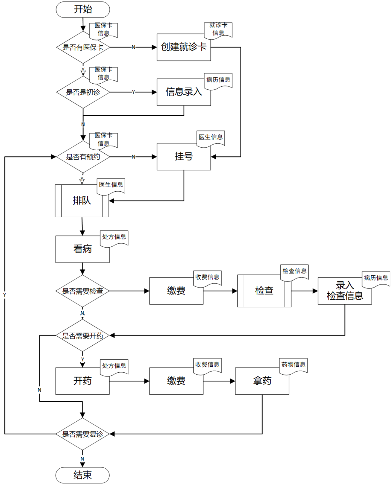

# 医院门诊信息管理系统（HIS-OP）

[English](README.en.md) | **中文**

一个基于 Vue 3 + FastAPI 的医院门诊信息管理系统，覆盖挂号、就诊、收费、取药等门诊全流程。

---

## 功能特性

### 已实现的模块

| 模块 | 功能说明 | 状态 |
|:----:|:--------|:----:|
| 登录认证 | 用户注册/登录、RSA密码加密、角色权限控制 | ✅ |
| 病人管理 | 病人注册、信息查询、挂号/预约 | ✅ |
| 医生管理 | 医生注册、信息查询、排班管理 | ✅ |
| 科室管理 | 科室创建、查询、主任设置 | ✅ |
| 挂号预约 | 现场挂号、预约挂号、取消、记录查询 | ✅ |
| 处方管理 | 医生开处方、自动库存扣减、处方查询 | ✅ |
| 收费管理 | 费用计算、在线缴费、收费记录查询 | ✅ |
| 药品管理 | 药品入库、库存查询、库存预警 | ✅ |
| 通知公告 | 按角色定向推送、紧急通知标记 | ✅ |

### 规划中的模块

| 模块 | 功能说明 | 状态 |
|:----:|:--------|:----:|
| 病历管理 | 电子病历书写、查询 | ✅ |
| 检查检验 | 检查申请、结果录入、报告查看 | ✅ |
| 排队叫号 | 候诊队列、语音叫号、过号处理 | ✅ |
| 药房发药 | 处方审核、发药确认、退药处理 | ✅ |
| 护士预检 | 生命体征录入、过敏史标记 | ✅ |
| 报表统计 | 门诊量、财务、药品、工作量统计 | ✅ |
| 随访管理 | 随访计划、复诊提醒 | ✅ |
| 满意度评价 | 就诊后评价、评分统计 | ✅ |

---

## 技术架构

```
┌─────────────────────────────────────────────────────────────┐
│                        前端层                                │
│                   vue3-new-ui                                │
│                   Vue 3 + Element-Plus                       │
├─────────────────────────────────────────────────────────────┤
│                        后端层                                │
│                    fastapi_be                                │
│              FastAPI + SQLAlchemy                            │
├─────────────────────────────────────────────────────────────┤
│                        数据层                                │
│                   MySQL / SQLite                             │
└─────────────────────────────────────────────────────────────┘
```

### 技术栈

| 层级 | 技术 |
|:----:|:-----|
| 前端 | Vue 3, Element-Plus, Axios, Pinia |
| 后端 | FastAPI, SQLAlchemy, Pydantic |
| 数据库 | MySQL 8.0, SQLite（开发环境） |
| 安全 | RSA密码加密, accessToken会话认证 |

---

## 项目结构

```
hoimsystem/
├── vue3-new-ui/          # Vue 3 前端（当前主分支）
│   ├── src/
│   │   ├── views/        # 页面组件
│   │   ├── api/          # 接口封装
│   │   ├── router/       # 路由配置
│   │   └── store/        # Pinia状态管理
│   └── package.json
│
├── fastapi_be/           # FastAPI 后端（当前主分支）
│   ├── app/
│   │   ├── routers/      # 路由模块
│   │   │   ├── user.py        # 登录认证
│   │   │   ├── admin.py       # 管理员
│   │   │   ├── patient.py     # 病人
│   │   │   ├── doctor.py      # 医生
│   │   │   ├── pharmacy.py    # 药房
│   │   │   ├── charge.py      # 收费
│   │   │   ├── queue.py       # 排队叫号
│   │   │   ├── checkin.py     # 报到签到
│   │   │   ├── vitalsign.py   # 护士预检
│   │   │   ├── lab.py         # 检查检验
│   │   │   ├── followup.py    # 复诊随访
│   │   │   ├── report.py      # 报表统计
│   │   │   └── system.py      # 系统管理
│   │   ├── models.py     # 数据库模型
│   │   ├── schemas.py    # Pydantic模型
│   │   └── main.py       # 应用入口
│   └── requirements.txt
│
├── doc/                  # 项目文档
│   ├── demandDoc.md      # 需求文档
│   ├── apiDoc.md         # API接口文档（82个接口）
│   ├── databaseDoc.md    # 数据库文档（25张表）
│   └── todos.md          # 待办事项
│
├── doc_assets/           # 文档资源（截图、流程图、SQL）
│
├── vue-ui/               # Vue 2.x 前端（已弃用，保留参考）
├── django_be/            # Django 后端（已弃用，保留参考）
│
└── README.md             # 本文件
```

---

## 快速开始

### 环境要求

- Node.js >= 16
- Python >= 3.8
- MySQL >= 8.0（或使用 SQLite）

### 1. 克隆项目

```bash
git clone https://github.com/Palpitate-xus/hoimsystem.git
cd hoimsystem
```

### 2. 启动数据库

```bash
# 创建 MySQL 数据库（或使用 SQLite）
mysql -u root -p -e "CREATE DATABASE hoimsystem CHARACTER SET utf8mb4;"
```

> 无需手动导入表结构，首次启动 FastAPI 后端时 SQLAlchemy 会自动建表。

### 3. 启动后端（FastAPI）

```bash
cd fastapi_be

# 创建虚拟环境（推荐）
python -m venv venv
source venv/bin/activate  # Linux/Mac
# 或 venv\Scripts\activate  # Windows

# 安装依赖
pip install -r requirements.txt

# 运行（自动创建表）
python -m uvicorn app.main:app --reload --host 0.0.0.0 --port 8000
```

### 4. 启动前端（Vue 3）

```bash
cd vue3-new-ui

# 安装依赖
npm install

# 开发模式
npm run serve

# 生产构建
npm run build
```

### 5. 访问系统

- 前端：http://localhost:8080
- 后端 API：http://localhost:8000/api
- API 文档：http://localhost:8000/docs（FastAPI 自动生成的 Swagger UI）

---

## 系统角色

系统支持四种角色，权限逐级扩展：

| 角色 | 权限范围 |
|:----:|:--------|
| 管理员 (admin) | 全局管理：医生、病人、科室、药品、通知、收费 |
| 科室主任 (director) | 科室管理：本科室排班、医生管理、发布通知 |
| 医生 (doctor) | 诊疗工作：病历、处方、排班查看 |
| 病人 (patient) | 自助服务：挂号/预约、缴费、查看记录 |

---

## 文档索引

| 文档 | 说明 |
|:----:|:-----|
| [需求文档](doc/demandDoc.md) | 功能需求、业务流程、数据需求、非功能性需求 |
| [API 文档](doc/apiDoc.md) | 全部 82 个接口定义（76 已实现 + 6 规划中） |
| [数据库文档](doc/databaseDoc.md) | 25 张表结构定义及 ER 关系图 |
| [TODO](doc/todos.md) | 项目待办事项清单（按优先级分类） |

---

## 截图预览



更多截图见 [doc_assets/](doc_assets/) 目录。

---

## 开发计划

详见 [doc/todos.md](doc/todos.md)。

近期重点：
1. 密码加密存储（bcrypt）
2. JWT Token 替换纯字符串 accessToken
3. 接口权限校验细化
4. 前端页面完善（数据修改/删除、报表统计）

---

## 许可证

[MIT](LICENSE)

---

## 贡献

欢迎提交 Issue 和 Pull Request。

如有问题，请联系：palpitate.xus@outlook.com
