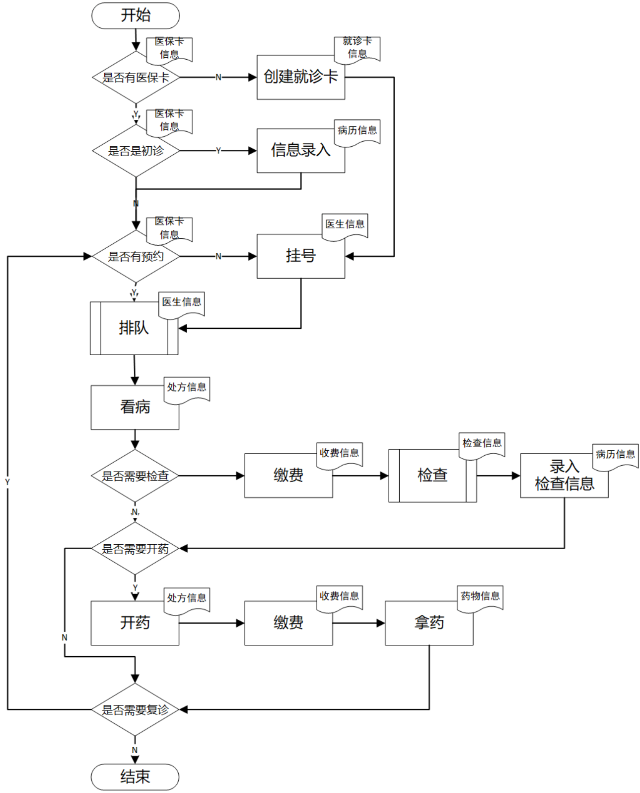

# 医院门诊信息管理系统需求文档
## 系统目标
随着计算机技术的发展，计算机在医院系统中的应用逐渐普及，利用医院门诊信息管理系统进行医院的运营减少了人力、物力资源的浪费，提高了工作效率和医院的整体竞争力。

医院门诊信息管理系统是现代化医院运营的必要技术支撑和基础设施，实现医院信息管理系统的目的就是为了以更现代化、科学化、规范化的手段来加强医院中病人、医生、病房、科室和药品的管理，同时实现门诊挂号自动化、医生诊断科学化、病历系统化、取药自动化等提高医院的工作效率，改进医疗质量。

## 系统功能分析

    图1 病人就医的主要流程

- 病人管理
    - 病人的信息录入、维护与查询
    - 医生对病人病历的录入、维护与查询
    - 医生对病人医嘱对录入、维护与查询
- 排队管理
    - 看病排队的规则
    - 检查排队的规则
- 检查管理，病人检查的结果
    - 检查名称、正常检查结果存储
    - 异常检查结果管理
- 挂号管理
    - 是否初诊，初诊则在系统中注册病人
    - 是否预约，预约取号
    - 病人挂号选择挂号时间、科室、医生；判断医生是否有剩余号，如果没有则挂号失败。
- 医生管理
    - 医生的信息录入、维护与查询
    - 姓名、性别、职称、工号、科室
    - 医生考勤签到管理
- 处方管理
    - 医生录入处方
    - 处方状态：未完成取药/已完成取药
    - 处方号、病人编号、处方信息、医生编号
- 收费管理
    - 根据处方信息自动生成发票信息
    - 病人划价、收费
- 科室管理
    - 科室的信息录入、维护与查询
    - 科室主任、医生、科室名、科室地址、科室电话
    - 科室的排班管理
- 药品管理
    - 药品的信息录入、维护与查询
    - 药品采购管理
    - 药品入库管理
    - 药品取出管理
    - 药品编号、药品名称、药品类别、库存量、单价
## 数据需求分析
根据功能需求分析的结果，医院信息管理系统的数据需求分析如下。
- 病人信息：姓名、性别、年龄、身份证号、联系电话、过敏史、单位、病人状态（是否住院）、医保卡/就诊卡号、注册时间等信息。系统检查所有信息填写正确后会提示病人信息注册成功。
- 挂号信息：病人编号、医生编号、挂号时间、科室编号、挂号类别（普通门诊/专家门诊）、就诊时间段、挂号状态（已挂号、已取消）、挂号费等信息。由病人录入，系统检查所有信息填写正确后会提示病人挂号成功，并返回挂号单编号（唯一标识）。
- 预约信息：预约编号、病人编号、医生编号、挂号时间、科室编号、预约挂号类别(普通门诊/专家门诊）、就诊时间段等信息。由病人录入，系统检查所有信息填写正确后会提示病人预约成功，并返回预约挂号单编号（唯一标识）。
- 检查信息：检查流水号、病人编号、检查编号、检查时间、检查异常结果（多值属性）。由医生录入，系统检查所有信息输入完全会提示检查完成，并返回检查编号（唯一标识）、检查异常结果。
- 标准检查信息：检查编号、检查名称、检查说明、检查须知、检查标准结果（多值属性）、检查地点、检查出结果所需时间、检查价格。提前储存相关信息在系统中。
- 排队信息：排队编号（唯一标识）、预约编号、病人编号、挂号时间、科室编号、预约挂号类别(普通门诊/专家门诊）、就诊时间段。
- 排班信息：医生编号、日期、科室编号、医生最大接诊数。由科室主任录入在系统中，并根据需要修改。
处方信息：病人姓名、病人编号、医生姓名、医生编号、药品编号、药品数量、医嘱等信息。系统检查所有信息填写正确后提示处方编辑成功，并返回处方号（唯一标识）。
- 病历信息：病人姓名、病人编号、就诊时间、医生姓名、医生编号、检查异常结果、病情信息。由医生录入，系统检查所有信息填写正确后提示病历录入成功，并返回病历编号（唯一标识）。
- 门诊病人收费信息：收费项目、项目单价、病人编号、处方编号、付款方式、付款日期等信息。系统随处方信息自动生成收费信息，并返回收费单号（唯一标识）。
- 药品信息：药品名称、药品批次、生产日期、采购日期、采购人、库存、价格、药品生产商、药品描述等信息。系统检查所有信息填写正确后提示药品录入成功，并返回药品编号（唯一标识）。
- 医生信息：医生编号、姓名、性别、职称、科室编号、学历水平等信息，系统检查所有信息填写正确后会提示医生信息注册成功，并返回医生编号（唯一标识）。
- 科室信息：科室编号、科室名称、科室电话、科室地址、主任医生编号等信息，系统检查所有信息填写正确后会提示科室信息注册成功，并返回科室编号（唯一标识）。
- 收费信息：病人姓名、病人编号（唯一标识）、就诊时间、医生姓名、医生编号、药品名称、药品数量、收费项目、项目单价、总费用。

## 业务规则分析及完整性约束分析
基于上述的功能需求和数据需求，通过进一步了解，医院信息管理系统业务规则及完整性约束如下。
- 一所医院由多个科室组成；一个科室由多名医生；一名医生只能属于一个科室。
- 系统记录每种药品当前的库存数量，药品入库时自动增加库存数量，药品出库时系统自动减少库存数量；当库存数量低于某一阈值时，则通知药品采购人员补货。
- 系统自动记录药品的有效日期，在到期前1个月提醒药房工作人员，在到期时提醒药房工作人员报废处理。
- 预约挂号最多提前7天，不能预约当天的号，在就诊前一天允许取消预约，。
- 病人在同一天的预约和挂号次数不能超过两次。
- 预约挂号凭借预约编号取号，系统在取号时自动生成挂号单编号。
- 病人现场挂号时，如果医生挂号已满着拒绝挂号。
- 病人在一个月内三次预约挂号未取号则暂停该病人预约资格一个月。
- 如果病人无医保卡，则病人在首次来医院时需要办理就诊卡，系统自动生成就诊卡号。
- 排队序号由病人在挂号时系统自动生成，对于预约病人，预约时间越早排队序号越小；对于现场挂号的病人，挂号时间越早排队序号越小。
- 在病人从系统获取编号时，系统自动提醒病人当前排队人数。如果排队过号，以此向后顺延5个号。
- 一个病历只能对应一个病人，但是可以对应多个医生。
- 一个病人在同一时间段只能挂号一次。
- 一个病人只有一个排队编号，一个排队编号也只对应一个病人。
- 一张处方单对应一个病人编号，但是可以对应多个医生编号、多个药品编号。
- 处方单的取药状态记录了该处方对应的病人是否取药完成的状态，系统根据病人是否已经完成取药自动修改处方单的取药状态。
- 在处方单的取药状态为未完成之前允许医生修改处方单，但是在病人取药之后不允许医生修改处方单。
- 一张处方单只能对应开一张发票，且只能划价一次。
- 一个医生在一个时间段只能接待一个病人。
- 一个病人只能对应一个主治医生，但一个主治医生可以对应多个病人。
- 医生如果有事停诊需要至少提前一天通知管理员，由管理员发布停诊信息。
- 检查时间由医生和患者协商后录入，医生须告知患者检查注意事项。
- 检查流水号对应病人检查结果相关信息，检查编号对应该检查类型的标准检查结果相关信息。
- 一个检查流水号只能对应一个病人，但一个病人可以对应多个检查流水号，即一个病人可以进行多个检查。
- 一个检查流水号只能对应一个检查编号，但一个检查编号可以对应多个检查流水号。
- 一张处方信息包含多个药品。
- 缴费一次可以包含多张处方单，一张处方单缴费一次。
