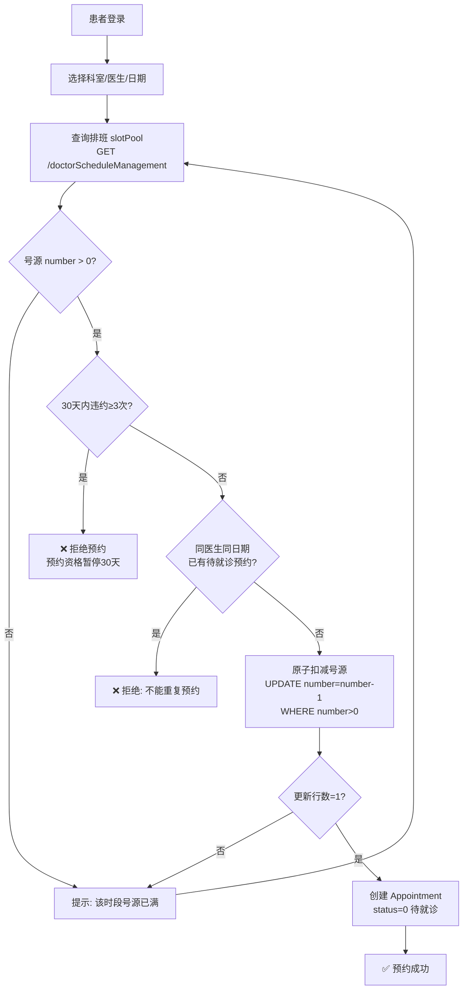
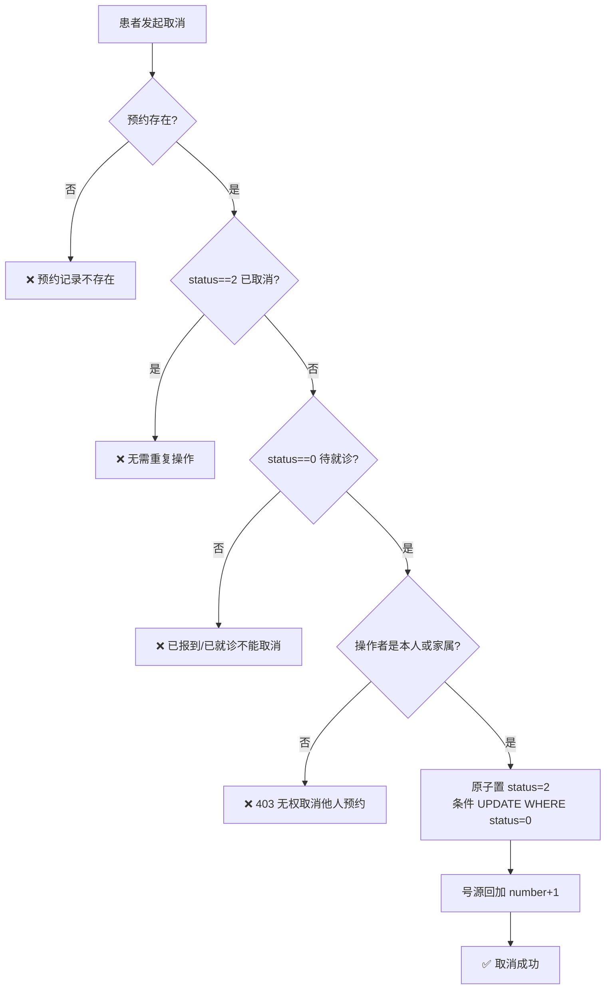
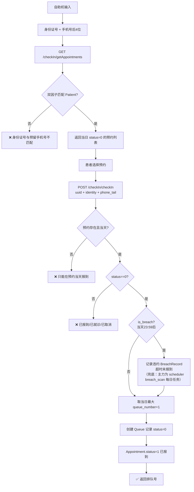
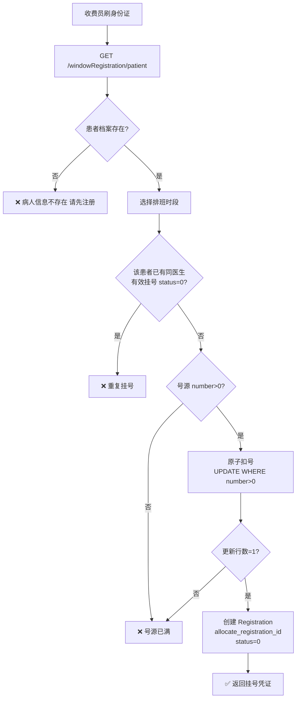
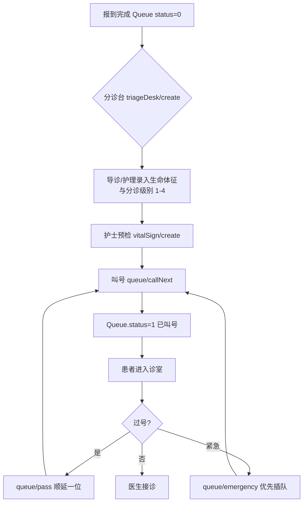
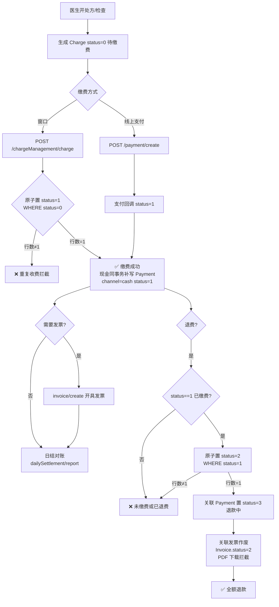
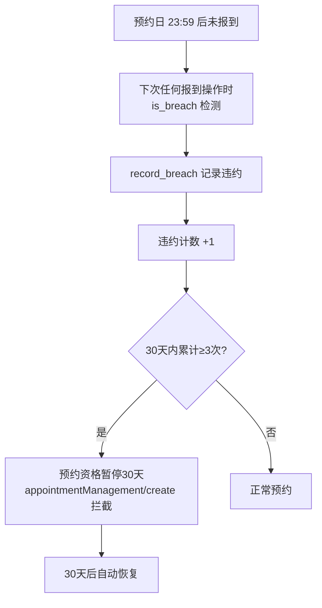

# 门诊挂号就诊业务流程图

> 数据来源：`app/routers/patient.py`、`checkin.py`、`charge.py`、`queue.py`、`doctor.py`（2026-08 代码实况）

## 1. 预约挂号全流程（患者端）

**关键校验**（代码位置）：
- 违约拦截：`patient.py:152-162`（BreachRecord 30天窗口计数）
- 挂号费：挂号成功自动产生 `Charge(charge_type="registration")`，普通/专家标准由 config 表配置（`registration_fee_common`/`registration_fee_specialist`）
- 违约扫描：`scheduler.py` breach_scan 每日任务——前一日未报到且未取消的预约记违约、置取消、回补号源（幂等）
- 排班匹配：`patient.py:163-168`（doctor/specialist/department 与 schedule 一致）
- 重复预约：`patient.py:175-182`
- 号源原子扣减：`patient.py:183-186`（条件 UPDATE 防并发超卖）

## 2. 预约取消

## 3. 自助报到（kiosk 双因子）

**防身份探测**：双因子（身份证+手机尾号）为 2026-08 安全加固，仅凭身份证号无法枚举他人预约。

## 4. 窗口挂号（收费员/挂号员代办）

**窗口退号**：`Registration.status 0→3`，号源回加 +1（`charge.py:440-468`）。已就诊（status≠0）不可退。

## 5. 分诊叫号

## 6. 门诊收费与退费

**并发安全**：缴费/退费均用条件 UPDATE + rowcount 校验，两个并发请求只有一个成功（`charge.py:98-146`）。**账目一致**：现金收费补写支付流水（收费域=支付域）；退费联动作废发票，作废票据不可再下载报销。

## 7. 违约管理

