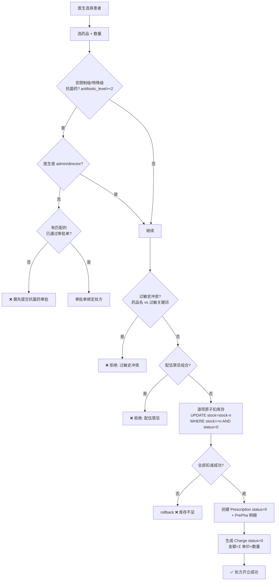
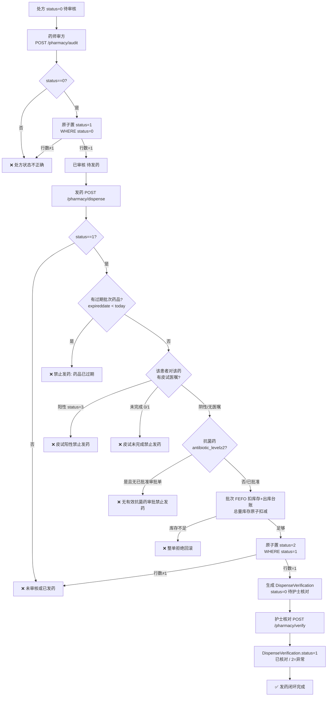
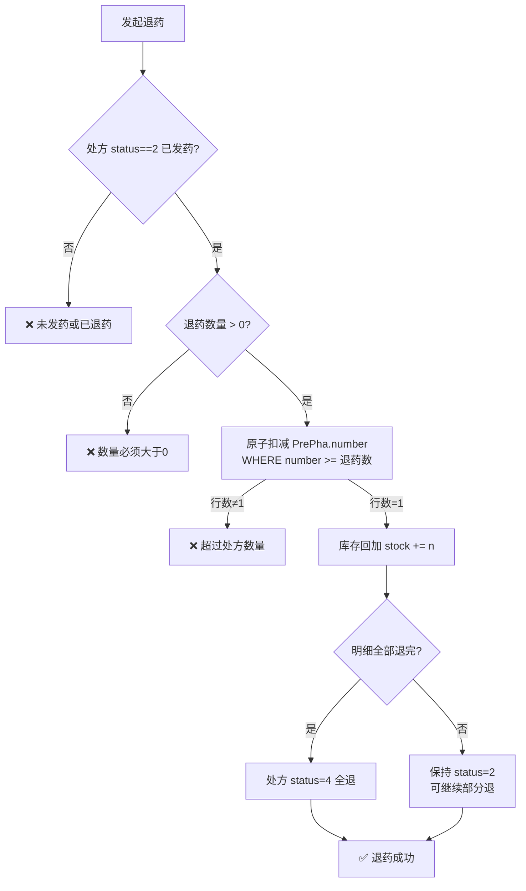
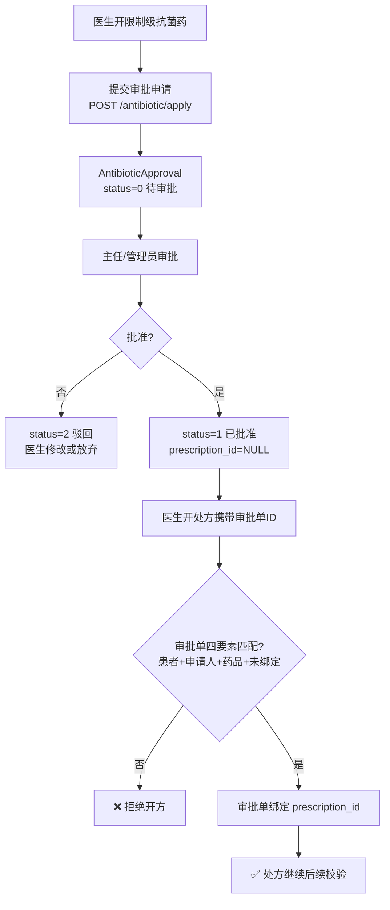
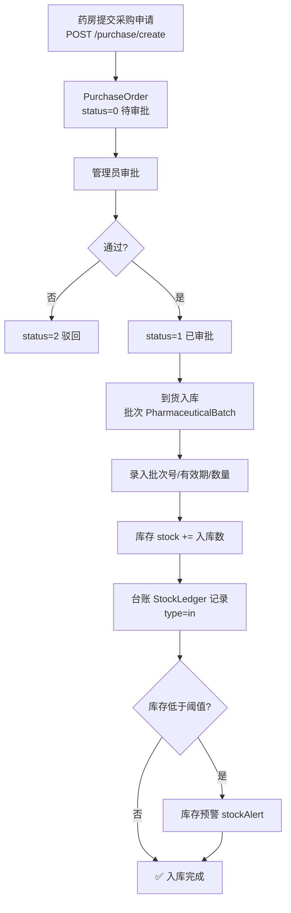
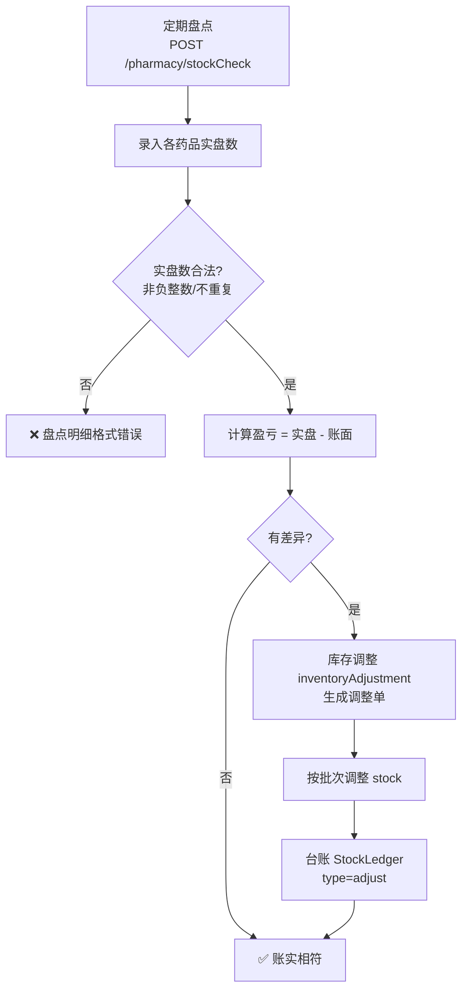
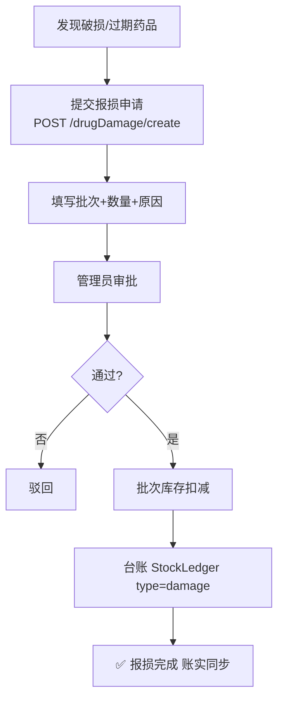
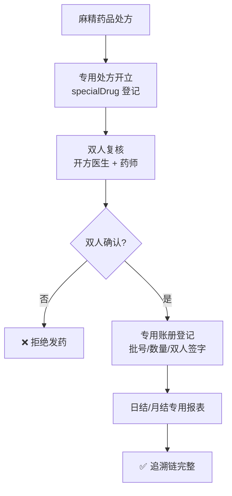
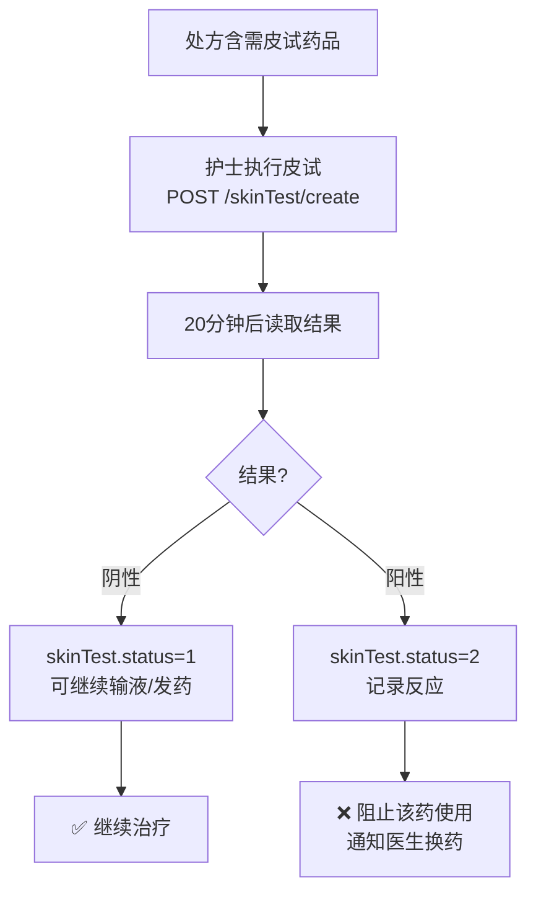

# 药品与药房业务流程图

> 数据来源：`app/routers/doctor.py`（处方开立）、`pharmacy.py`（审方/发药/退药）、`purchase.py`、`drug_damage.py`、`antibiotic.py`、`special_drug.py`、`skin_test.py`（2026-08 代码实况）

## 1. 处方开立（医生工作站）

**关键校验**：
- 抗菌药审批：`doctor.py:349-379`（审批单需 patient/applicant/drug 三匹配且未绑定处方）
- 过敏匹配：`doctor.py:381-410`（词边界精确匹配，避免 partial match 误判）
- 库存原子扣减：`doctor.py:436-448`（条件 UPDATE 防负库存/并发双扣）

## 2. 药房审方与发药

> **FEFO 出库**：发药按"先过期先出"从批次扣减并写 `PharmaceuticalStockLedger`（outbound）；未启用批次管理的药品跳过批次账（总量库存开方时已预留扣减）。退药走 `_return_to_batches` 回冲批次并写 return 台账。

## 3. 退药回冲

**并发安全**：退药数量校验并入 UPDATE 条件，并发退药不会超退（`pharmacy.py:228-239`）。

## 4. 抗菌药分级审批

## 5. 采购入库与库存台账

## 6. 库存盘点与调整

## 7. 药品报损

## 8. 特殊药品（麻精）双人管理

## 9. 皮试流程

