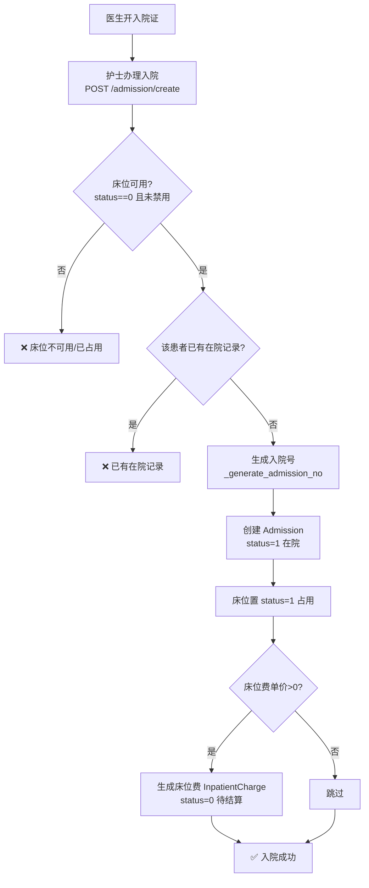
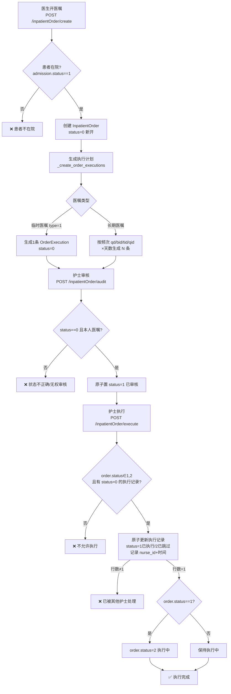
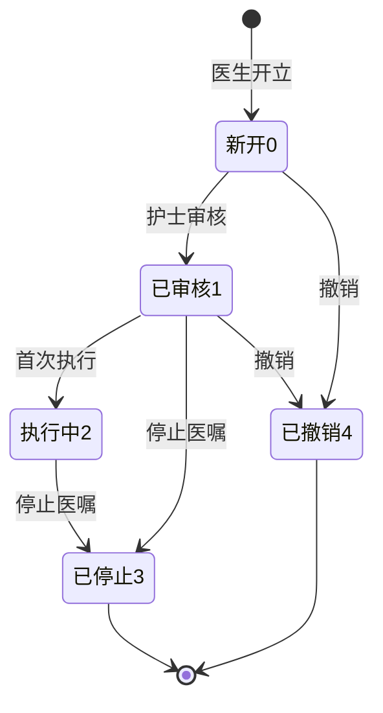
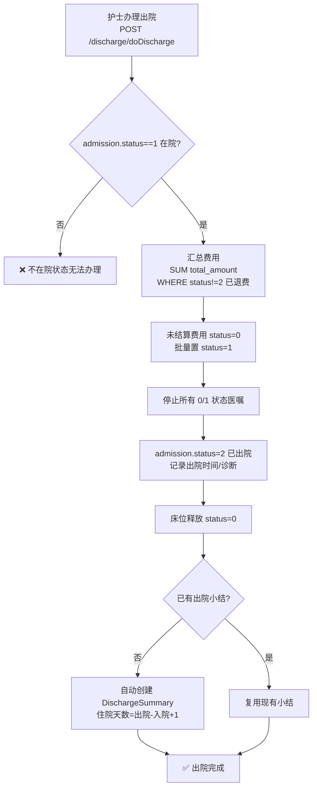
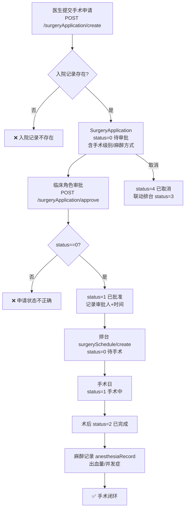
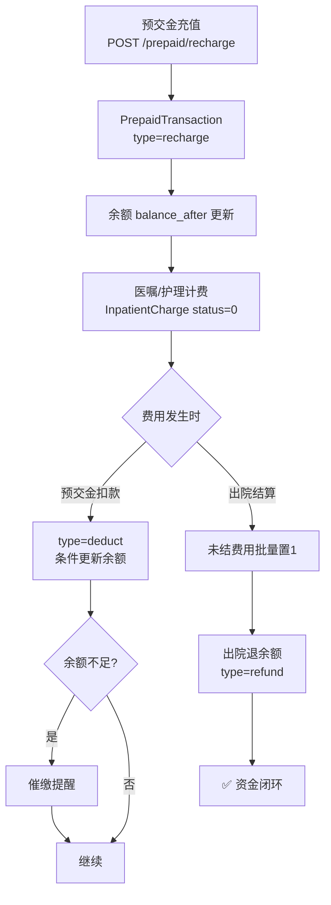
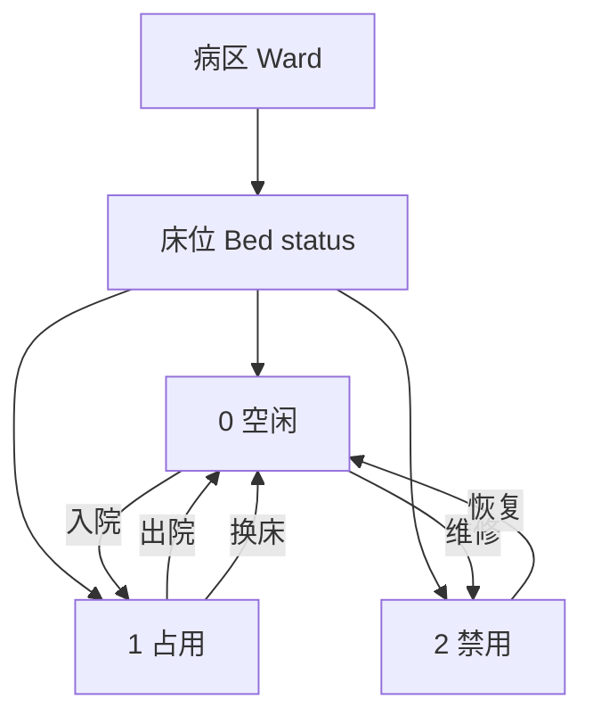

# 住院与手术业务流程图

> 数据来源：`app/routers/admission.py`、`discharge.py`、`inpatient_order.py`、`surgery.py`、`inpatient_charge.py`、`ward.py`（2026-08 代码实况）

## 1. 入院登记

**入院类型**：0 门诊入院 / 1 急诊入院 / 2 转诊入院 / 3 预约入院（`admission.py:50`）。

## 2. 住院医嘱全生命周期

**医嘱状态机**：`0 新开 → 1 已审核 → 2 执行中 → 3 已停止`；`0/1 → 4 已撤销`（`inpatient_order.py:95`）。

**停止/撤销联动**：停止与撤销均将未执行（status=0）的执行计划批量置 3 已取消；撤销额外将关联费用记录标记退费（`inpatient_order.py:269-339`）。**出院自动停止**：办理出院时所有 0/1 状态医嘱自动置 3，防止出院后仍被检查执行（`discharge.py:44-53`）。

## 3. 出院结算

**费用口径**：出院时以 `status != 2`（排除已退费）汇总应收，未结费用自动转已结（`discharge.py:32-41`）。

## 4. 手术审批与排台

**越权防护**：审批与列表均限临床角色（2026-08 安全修复，患者角色无法审批手术）。

## 5. 住院费用与预交金

## 6. 病区床位管理

**床位校验**：入院时校验床位 status=0 且未禁用（`admission.py:96-104`）；出院时释放（`discharge.py:60-63`）。
