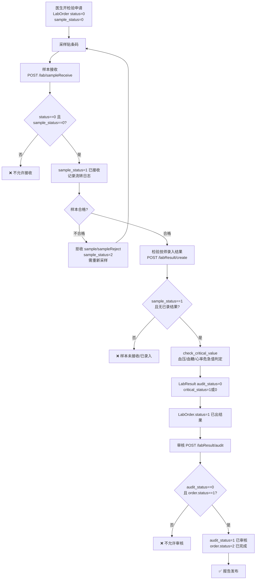
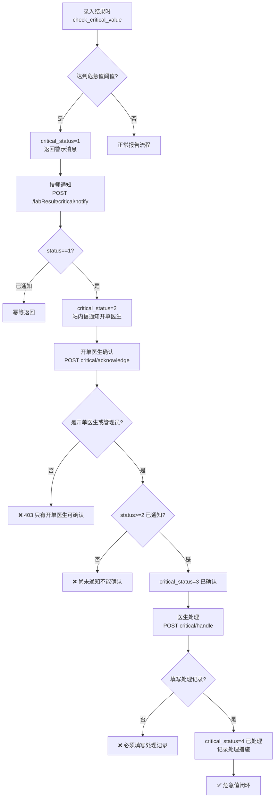
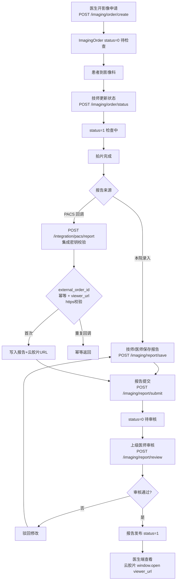
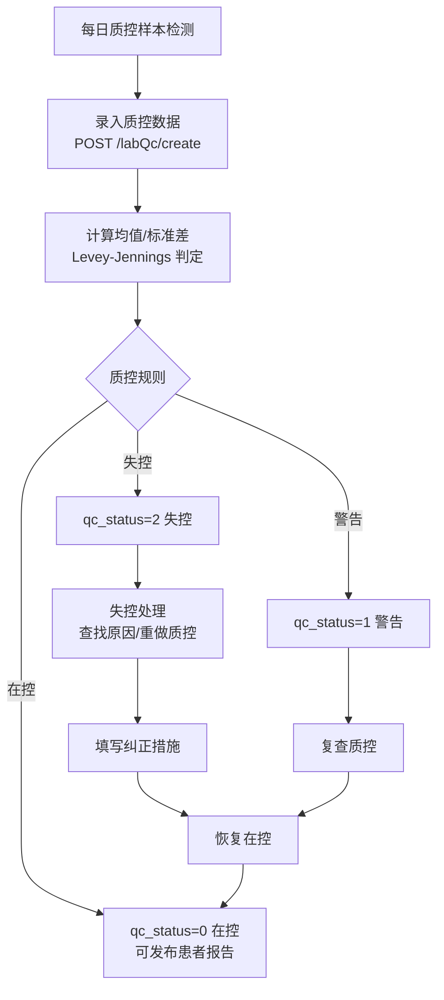
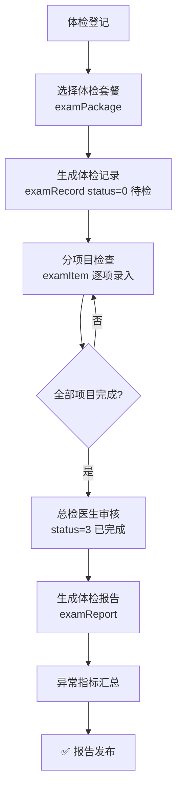

# 医技检查检验业务流程图

> 数据来源：`app/routers/lab.py`、`imaging.py`、`integration.py`、`exam.py`、`lab_qc.py`（2026-08 代码实况）

## 1. 检验全流程（申请→报告）

## 2. 危急值闭环管理

**状态链**：`0 非危急 → 1 待通知 → 2 已通知 → 3 已确认 → 4 已处理`，每步条件 UPDATE + 幂等返回（`lab.py:233-321`）。确认与处理仅限开单医生（或管理员）。

## 3. 影像检查（PACS 对接）

## 4. 检验质控（QC）

## 5. 体检管理

**患者数据隔离**：examRecord/examReport/examResult 的列表与详情接口对 patient 角色强制过滤本人记录（2026-08 安全修复）。
