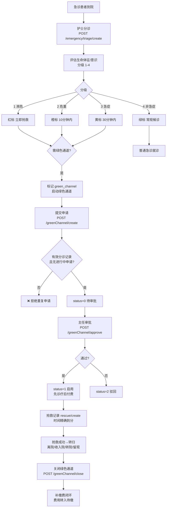
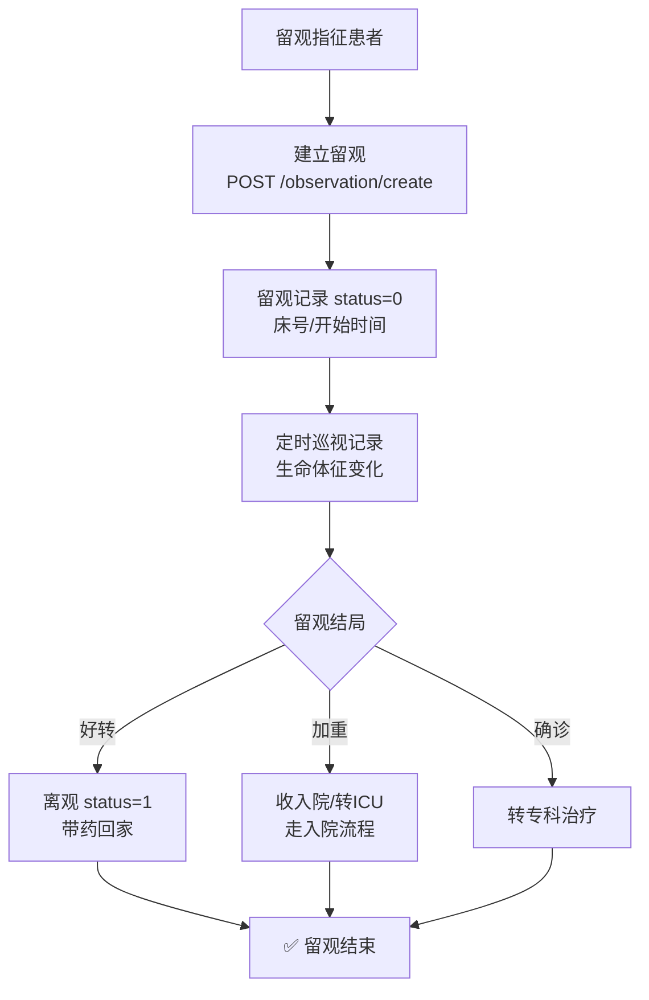
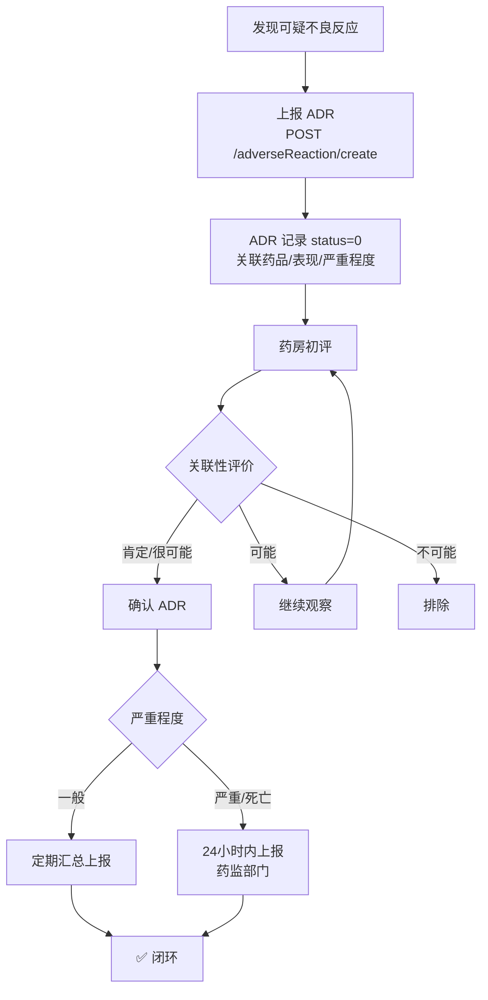
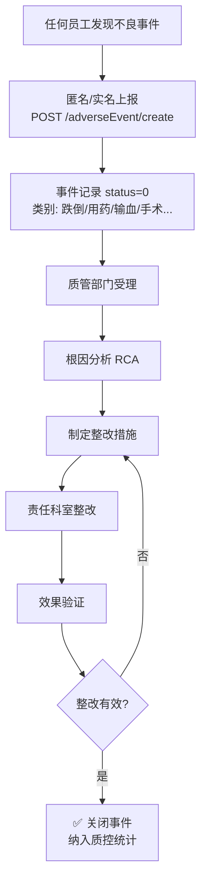
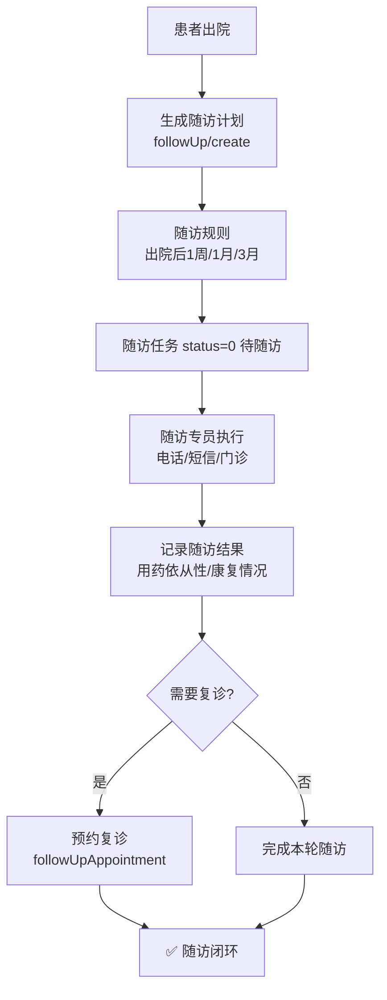

# 急诊与公共卫生业务流程图

> 数据来源：`app/routers/emergency.py`、`infection.py`、`blood.py`、`adverse_reaction.py`、`adverse_event.py`、`followup.py`（2026-08 代码实况）

## 1. 急诊分诊与绿色通道



## 2. 急诊留观



## 3. 院感上报与干预

```mermaid
flowchart TD
    A[发现院内感染疑似] --> B[护士/医生上报<br/>POST /infection/create]
    B --> C[感染病例记录<br/>status=0 待确认]
    C --> D[院感科核实]
    D --> E{确认院感?}
    E -- 否 --> F[排除 status=排除]
    E -- 是 --> G[确认感染<br/>判定感染部位/类型]
    G --> H{爆发倾向?<br/>同区域≥3例]
    H -- 是 --> I[启动爆发调查<br/>上报疾控]
    H -- 否 --> J[个案干预]
    I --> K[环境采样/隔离措施]
    K --> L[干预措施记录]
    J --> L
    L --> M[✅ 干预闭环<br/>统计报表]
```

## 4. 临床用血

```mermaid
flowchart TD
    A[医生评估用血指征] --> B[提交用血申请<br/>POST /blood/create]
    B --> C[填写血型/申请量<br/>用血原因]
    C --> D{血型匹配校验<br/>患者血型 vs 申请血型]
    D -- 不匹配 --> E[❌ 拒绝 异型输血]
    D -- 匹配 --> F[申请单 status=0]
    F --> G[血库备血<br/>交叉配血试验]
    G --> H{交叉配血相合?}
    H -- 不合 --> I[❌ 重新选血源]
    H -- 相合 --> J[发血 status=1]
    I --> G
    J --> K[护士双人核对输血]
    K --> L[输血反应监测]
    L --> M{出现反应?}
    M -- 是 --> N[停止输血<br/>上报输血不良反应]
    M -- 否 --> O[输血完成 status=2<br/>记录实际用量]
    N --> P[ADR 上报流程]
    O --> Q[✅ 用血闭环]
```

## 5. 药品不良反应（ADR）监测



## 6. 不良事件上报（系统级）



## 7. 出院随访


