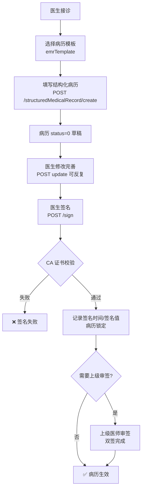
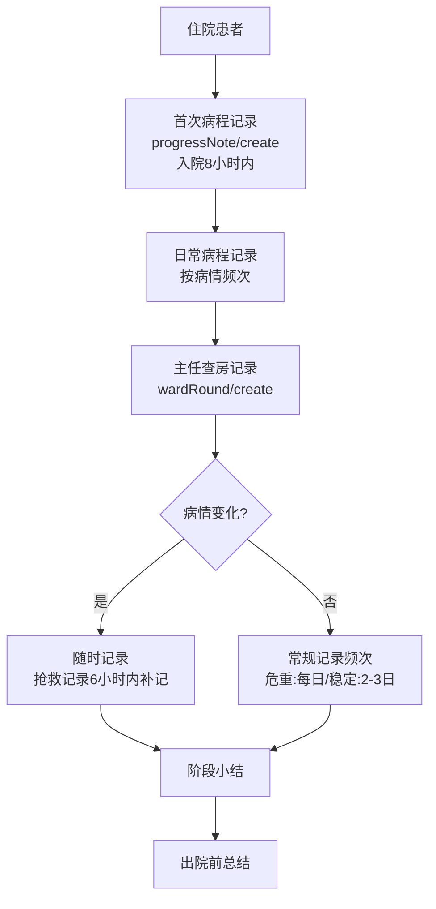
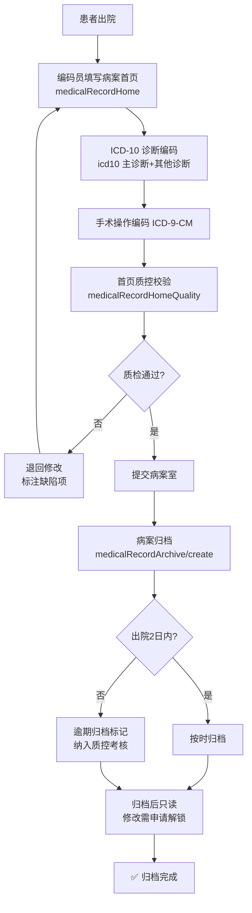
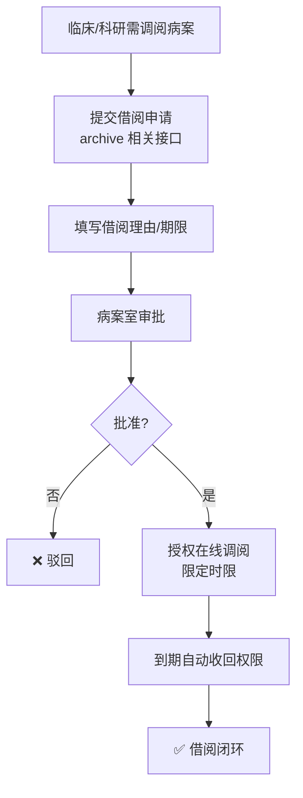
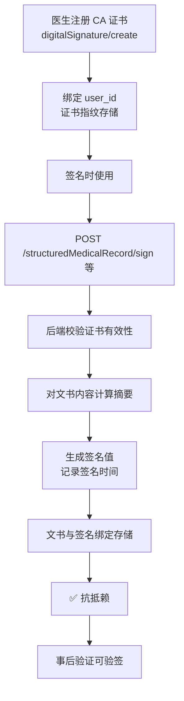
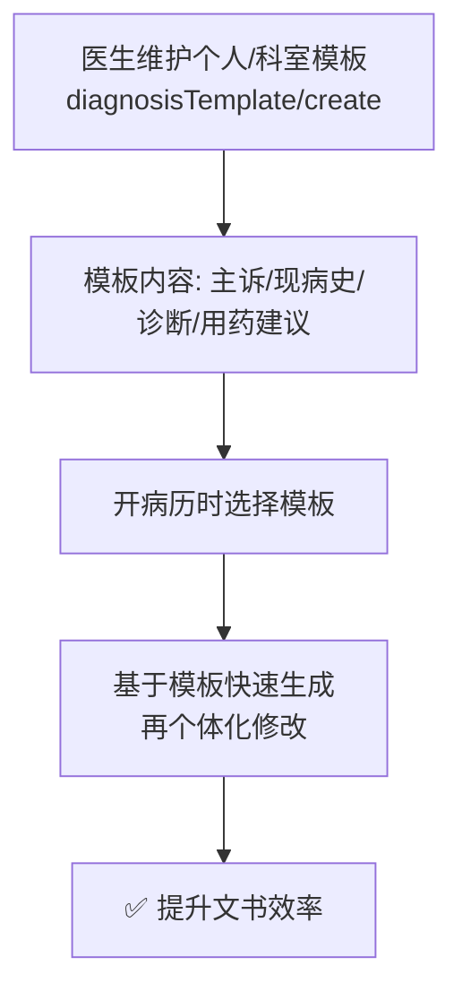

# 病历文书业务流程图

> 数据来源：`app/routers/emr.py`、`medical_record_archive.py`、`medical_record_home.py`、`medical_record_home_quality.py`、`digital_signature.py`、`icd10.py`、`diagnosis_template.py`（2026-08 代码实况）

## 1. 结构化病历与签名

## 2. 病程记录与查房

## 3. 病案首页与归档

## 4. 病案借阅

## 5. 电子签名（CA）

## 6. 诊断模板

