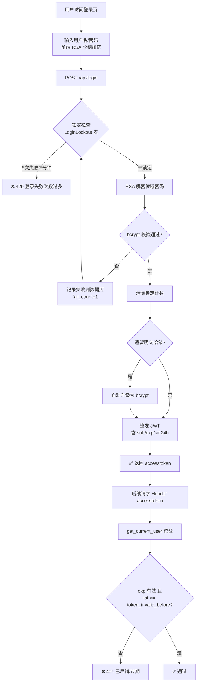
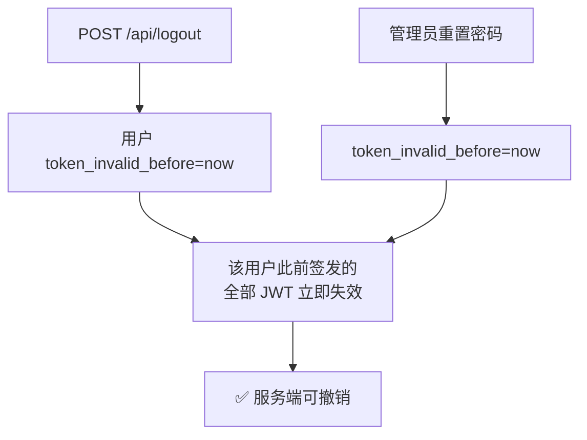
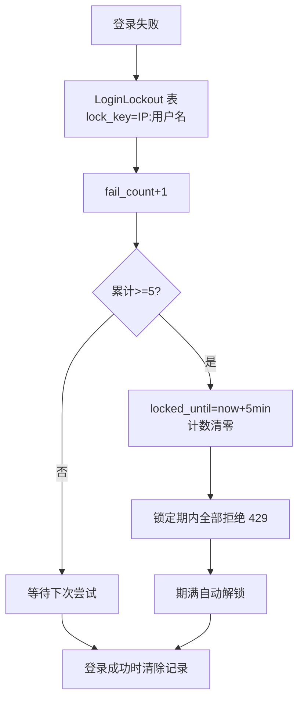
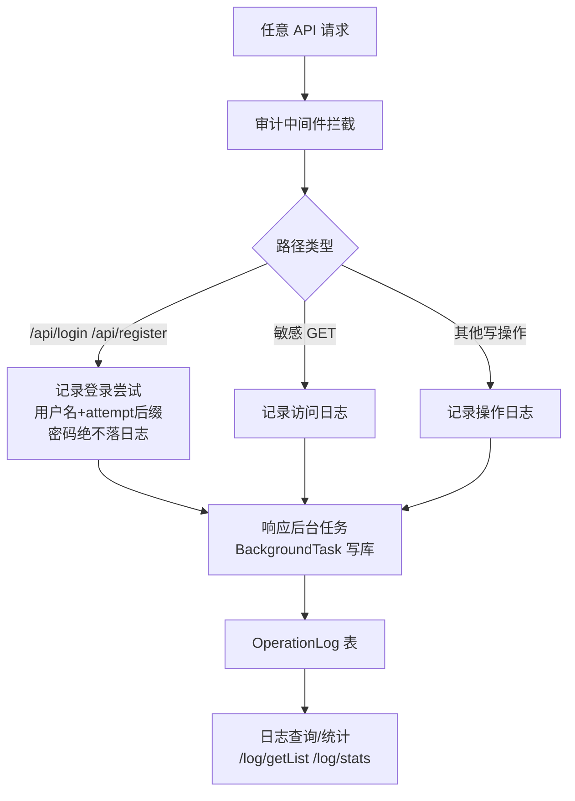
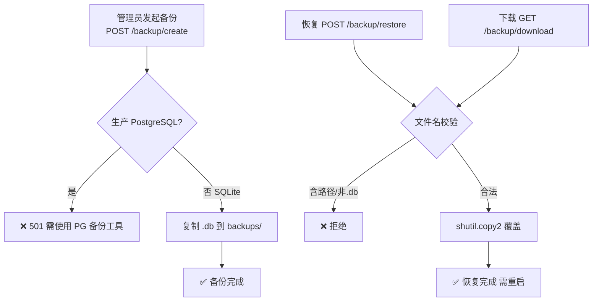
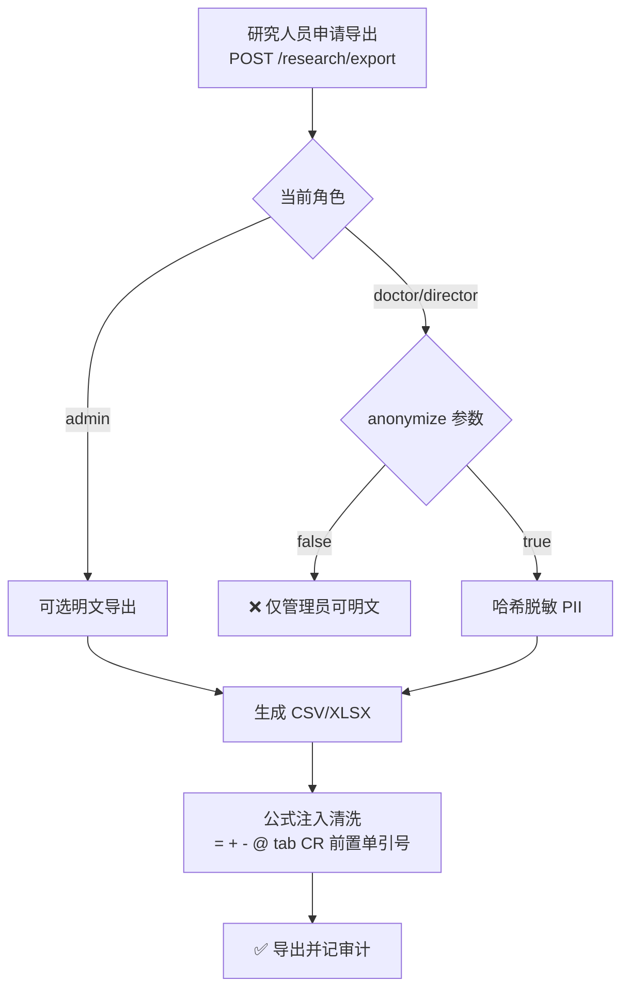
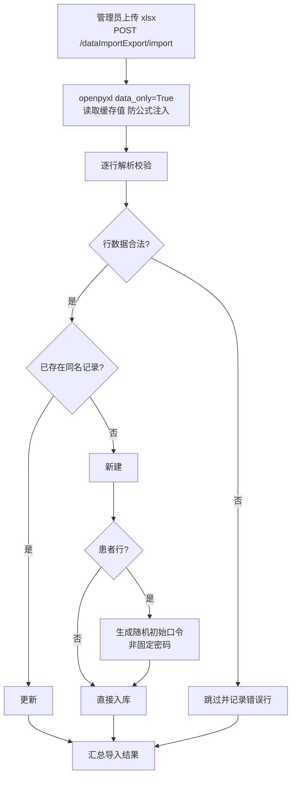
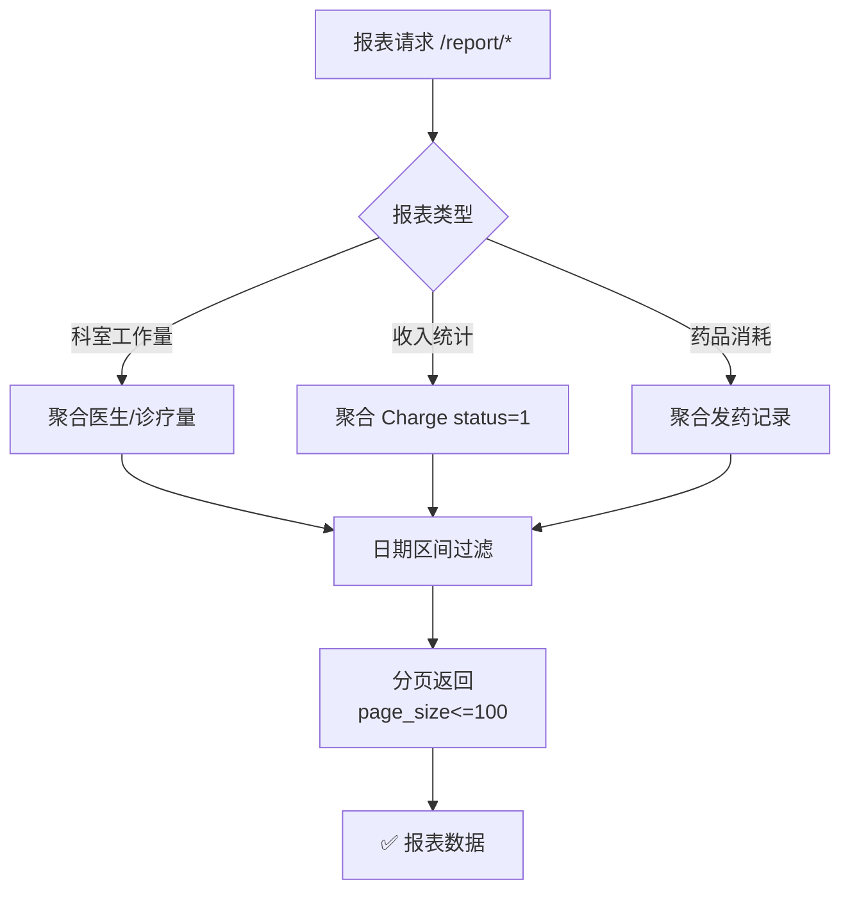
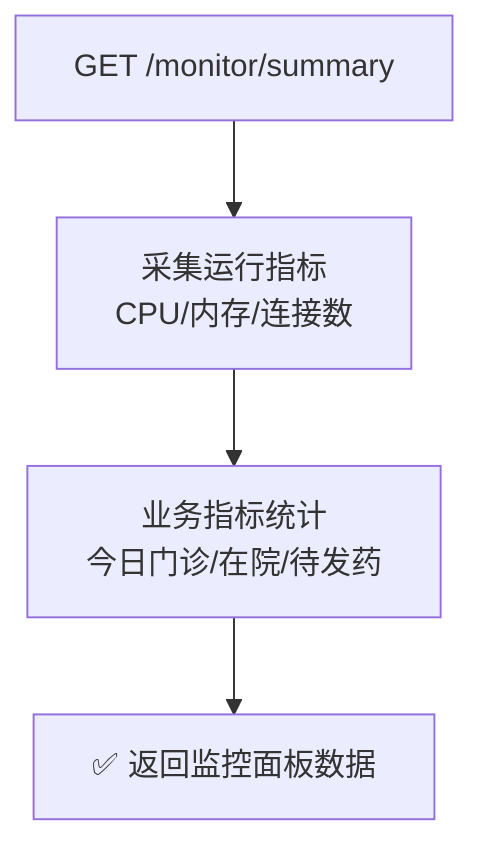
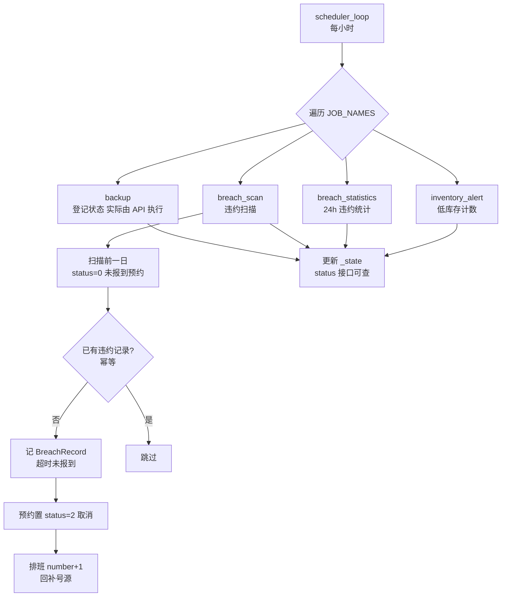

# 系统管理与安全业务流程图

> 数据来源：`app/routers/user.py`、`admin.py`、`system.py`、`monitor.py`、`backup.py`、`data_import_export.py`、`research.py`、`report.py`（2026-08 代码实况）

## 1. 用户认证（登录/注册）

**注册**：患者自助注册统一返回模糊提示（防账号枚举）；首次注册自动创建 Patient 档案。

## 2. 登出与 Token 吊销

## 3. 登录失败锁定（跨 worker）

## 4. 操作审计

## 5. 数据备份恢复

## 6. 科研数据导出

## 7. 数据导入（Excel 批量）

## 8. 统计报表

## 9. 系统监控

## 10. 定时任务（scheduler.py）

> 手动触发：`POST /scheduler/run`（admin）；状态查询：`GET /scheduler/status`。单任务失败不影响其他任务与主服务。
