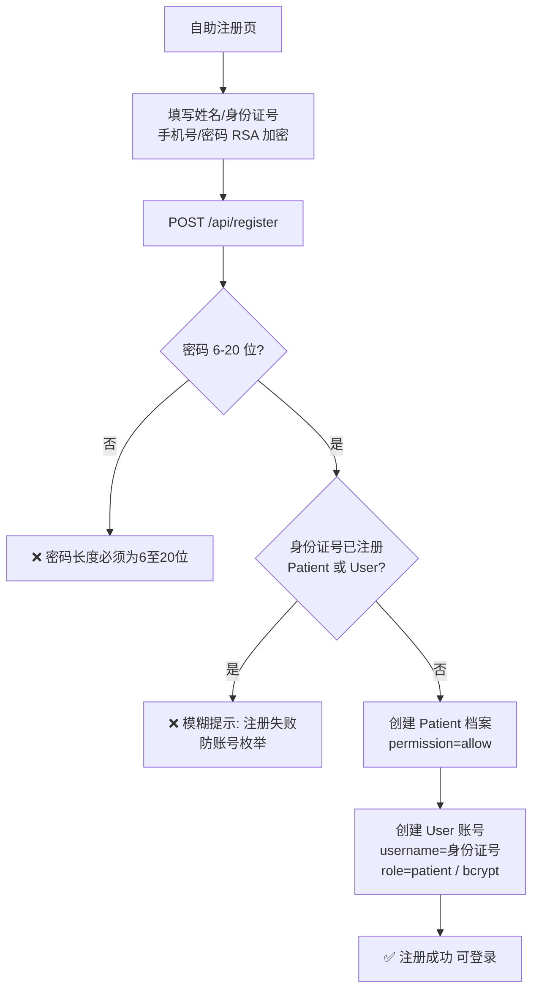
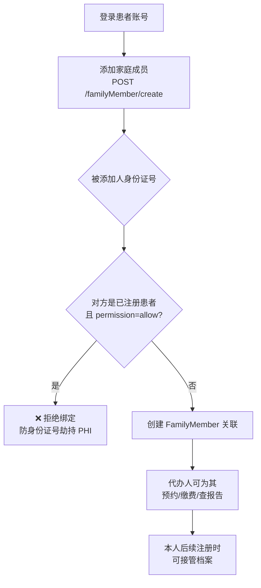
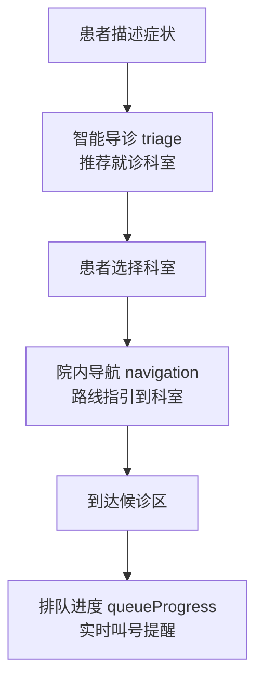
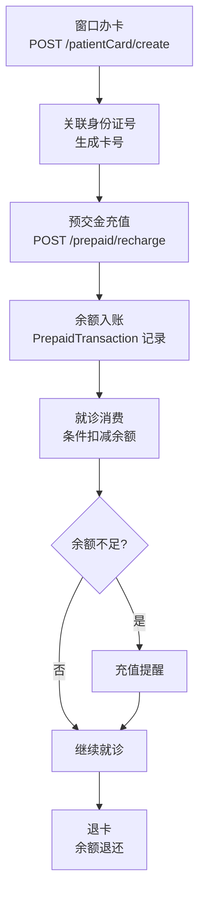
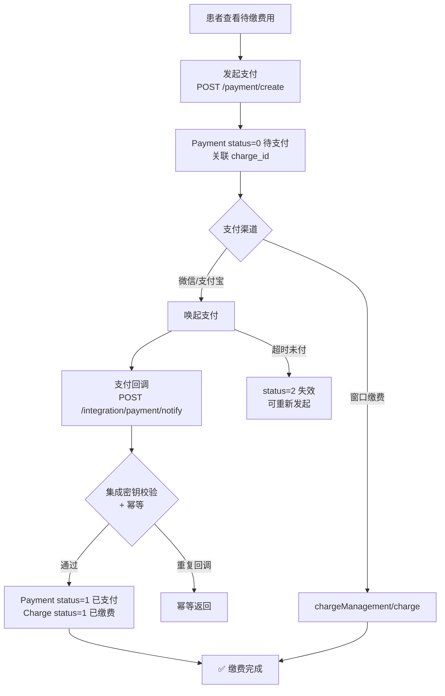
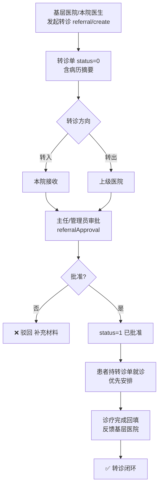
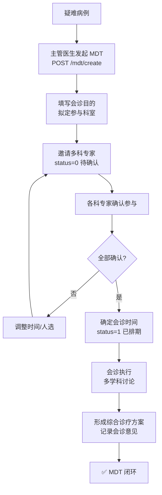
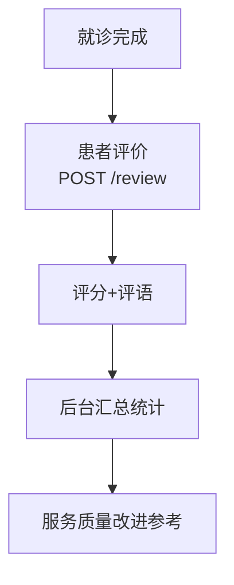

# 患者服务业务流程图

> 数据来源：`app/routers/patient.py`、`family_member.py`、`patient_card.py`、`referral.py`、`mdt.py`、`charge.py`（prepaid/payment）、`triage_desk.py`（2026-08 代码实况）

## 1. 患者注册

## 2. 家庭成员代办

**劫持防护**：2026-08 安全修复——已注册且授权（permission=allow）的患者档案禁止被他人以家庭成员方式绑定。

## 3. 智能导诊与院内导航

## 4. 就诊卡管理

## 5. 线上支付

## 6. 双向转诊

## 7. 多学科会诊（MDT）

## 8. 就诊评价

