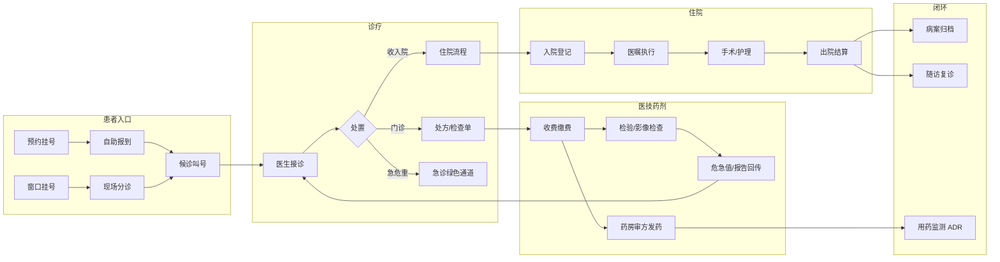

# 业务流程图总览

> 全部 9 组流程图基于 2026-08 后端代码实况绘制（AST/逐行核对），Mermaid 格式可在 GitLab/GitHub/Typora/VS Code 直接渲染。

| # | 文档 | 覆盖业务域 | 流程图数 |
|---|------|-----------|---------|
| 1 | [01-门诊挂号就诊.md](01-门诊挂号就诊.md) | 预约/取消/自助报到/窗口挂号/分诊叫号/收费退费/违约管理 | 7 |
| 2 | [02-药品药房.md](02-药品药房.md) | 处方开立/审方发药/退药/抗菌药审批/采购盘点/报损/麻精/皮试 | 9 |
| 3 | [03-住院手术.md](03-住院手术.md) | 入院/医嘱状态机/出院结算/手术审批排台/预交金/床位 | 7 |
| 4 | [04-医技检查检验.md](04-医技检查检验.md) | 检验全流程/危急值闭环/影像PACS/质控/体检 | 5 |
| 5 | [05-急诊公卫.md](05-急诊公卫.md) | 急诊分诊/绿色通道/留观/院感/用血/ADR/不良事件/随访 | 7 |
| 6 | [06-病历文书.md](06-病历文书.md) | 结构化病历签名/病程查房/病案首页归档/借阅/CA签名/诊断模板 | 6 |
| 7 | [07-系统管理安全.md](07-系统管理安全.md) | 登录认证/登出吊销/失败锁定/审计/备份/科研导出/导入/报表/监控 | 9 |
| 8 | [08-患者服务.md](08-患者服务.md) | 注册/家庭成员/导诊导航/就诊卡/线上支付/转诊/MDT/评价 | 8 |
| 9 | [09-HIS补齐模块.md](09-HIS补齐模块.md) | 审方规则引擎/医保对照/CSSD/PIVAS/ICU评分/路径/MDRO/手卫生/报卡/RCA/HQMS | 11 |

## 全院业务总览

## 图例约定

- 流程图中的 `status=N` 均为数据库实际存储的整型状态值，与 `doc/data-dictionary.md` 枚举对应
- `原子置/原子扣减` 表示条件 UPDATE + rowcount 校验的并发安全写法（本系统资金/库存/状态流转统一采用）
- `❌` 表示业务拒绝路径，`✅` 表示成功终点
- 代码位置引用格式：`文件:行号`
