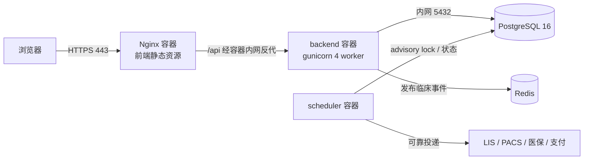

# HOIM 系统安装部署手册

> **版本**：未发布版（2026-09-03）　**适用对象**：系统实施/运维人员
> 配套文档：软件说明书（software-manual.md）· 安全上线清单（security-launch-checklist.md）

---

## 一、部署架构



六服务固定编排在 `docker-compose.yml`：
- **redis**：跨 worker 临床事件广播与最近事件回放，AOF 持久化
- **db**：postgres:16-alpine，仅 `expose 5432`（不映射宿主机端口），带健康检查
- **migrate**：一次性迁移服务，成功后 API 和调度器才启动
- **backend**：python:3.12-slim + gunicorn（4 worker × UvicornWorker），绑定 `127.0.0.1:8000`
- **scheduler**：库存/违约/运营聚合和集成发件箱独立调度进程
- **frontend**：Nginx，80 对外（生产建议前置 TLS 或直接配 443）

---

## 二、环境准备

### 2.1 硬件

| 项 | 最低 | 推荐 |
|----|------|------|
| CPU | 2 核 | 4 核+ |
| 内存 | 4 GB | 8 GB+ |
| 磁盘 | 40 GB | 100 GB+ SSD |

### 2.2 软件依赖

```bash
# Docker 24+ 与 Compose v2
curl -fsSL https://get.docker.com | sh
docker compose version   # 确认 v2
```

---

## 三、生产部署步骤

### 3.1 获取代码

```bash
git clone <仓库地址> /opt/hoimsystem
cd /opt/hoimsystem
```

### 3.2 配置环境变量

```bash
cp fastapi_be/.env.example .env
```

编辑仓库根目录 `.env`（Compose 变量插值读取此文件）：

```ini
# 必填（生产）
ENVIRONMENT=production
POSTGRES_PASSWORD=<数据库强密码>
SECRET_KEY=<openssl rand -base64 48 生成>
ALLOWED_ORIGINS=https://his.your-hospital.cn

# 可选（启用集成时）
LIS_INTEGRATION_KEY=...
PACS_INTEGRATION_KEY=...
MEDICAL_INSURANCE_INTEGRATION_KEY=...
PAYMENT_INTEGRATION_KEY=...
LIS_OUTBOUND_URL=https://...
PACS_OUTBOUND_URL=https://...

# 可选（多 worker RSA 传输密钥共享，建议显式配置）
# TRANSPORT_RSA_PRIVATE_KEY_PEM=<PEM 内容单行转义>
```

> `ALLOWED_ORIGINS` 禁止 `*`；未配置时生产模式启动失败（fail-fast）。

### 3.3 构建与启动

```bash
docker compose build
docker compose up -d
docker compose ps        # migrate 成功退出，其余五个服务 healthy/running
```

### 3.4 数据库初始化

```bash
# migrate 服务已自动升级到最新 schema；检查迁移状态
docker compose logs migrate

# 仅在系统尚无管理员时交互式创建首个强口令超级管理员
docker compose exec backend python bootstrap_admin.py --username <管理员工号>
```

生产环境会拒绝运行 `seed_default_accounts.py`，不得写入 `admin/admin123` 等演示账号。首个管理员创建后，其他员工账号通过系统权限管理和医院身份开通流程创建。

### 3.5 验证

```bash
# 存活与就绪检查
curl -fsS http://127.0.0.1:8000/health/live
curl -fsS http://127.0.0.1:8000/health/ready

# 前端可访问
curl -sI http://<服务器IP>/ | head -1

# 迁移版本与指标
docker compose exec backend alembic current
curl -fsS http://127.0.0.1:8000/metrics | head
```

功能冒烟：浏览器打开 `http://<服务器IP>`，用刚创建的管理员登录，依次点开“医生管理/挂号/报表”确认无 500。

---

## 四、HTTPS 配置（生产必须）

方案 A：在现有 Nginx 容器配置证书（修改 `vue3-new-ui/nginx.conf` 增加 443 server 块）。

方案 B（推荐）：前置独立 TLS 网关/负载均衡，转发到 Nginx 80。

证书要求：正规 CA 签发，覆盖医院域名；JKS/PEM 均可，Nginx 用 PEM。

配置后验证：`curl -sI https://his.your-hospital.cn` 返回 200，且 `curl -I http://...` 301 跳转 https。

---

## 五、数据备份策略

| 环境 | 方式 | 说明 |
|------|------|------|
| 生产 PostgreSQL | `pg_dump` + WAL 归档 | 每日全量；备份页面在 PG 模式返回 501 |
| 开发 SQLite | 系统管理 > 数据备份 | 页面一键备份/恢复/下载 |

```bash
# 每日 02:00 备份示例（cron）
0 2 * * * docker compose -f /opt/hoimsystem/docker-compose.yml exec -T db \
  pg_dump -U hoim hoim | gzip > /backup/hoim-$(date +\%F).sql.gz
```

恢复演练每季度一次：新库 `alembic upgrade head` 后导入备份，抽查患者/收费数据。

---

## 六、升级发布

1. 备份数据库（见上）
2. `git pull` 拉取新版本
3. `docker compose build && docker compose up -d`
4. 确认一次性 `migrate` 服务成功退出，`/health/ready` 返回 200
5. 冒烟验证（登录/挂号/收费各走一遍）
6. 回滚预案：切回旧 tag；若迁移不可向后兼容则按发布方案恢复备份

详细流程见 `doc/release-process.md`。

---

## 七、监控与日志

| 内容 | 位置 |
|------|------|
| 应用日志 | `docker compose logs -f backend`（stdout） |
| 操作审计 | 系统管理 > 操作日志（DB 持久化） |
| 系统监控 | 系统管理 > 系统监控（CPU/内存/连接数/业务指标） |
| Nginx 访问日志 | `docker compose logs frontend` |

告警接入与 Runbook 见 `doc/monitoring.md`。

---

## 八、故障排查

| 现象 | 排查 |
|------|------|
| backend 起不来 | `docker compose logs backend`；多半是必填环境变量缺失（SECRET_KEY/POSTGRES_PASSWORD/ALLOWED_ORIGINS） |
| 登录 429 | 登录失败锁定（5 次/5 分钟），等 5 分钟或查 `hoimsystem_login_lockouts` 表 |
| 多 worker 登录随机失败 | RSA 密钥未共享：配置 `TRANSPORT_RSA_PRIVATE_KEY_PEM` 或确认密钥文件路径 4 worker 可写 |
| 前端 502 | backend 未起或 8000 端口未绑 127.0.0.1；`docker compose ps` 检查 |
| 迁移报 MultipleHeads | 本仓库已用 merge revision 归一；若出现请 `alembic heads` 检查是否有未提交的分叉迁移 |

更多见 `doc/troubleshooting.md`。

---

## 九、安全加固清单（上线阻断项）

1. [ ] 未运行演示账号脚本；首个管理员通过 `bootstrap_admin.py` 使用独立强口令创建
2. [ ] SECRET_KEY / POSTGRES_PASSWORD / ALLOWED_ORIGINS 已配置
3. [ ] HTTPS 已启用
4. [ ] DATABASE_URL 指向 PostgreSQL（禁 SQLite）
5. [ ] 集成密钥已配置（若启用 LIS/PACS/医保/支付）
6. [ ] TRANSPORT_RSA_PRIVATE_KEY_PEM 已配置（多 worker）
7. [ ] 镜像内无 *.db / backups（.dockerignore 已处理，构建镜像后人工验证）

完整清单：`doc/security-launch-checklist.md`
