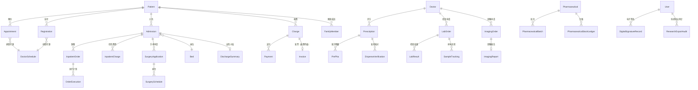

# HOIM 医院信息管理系统 · 软件说明书

> **版本**：v1.0（2026-08）　**文档定位**：软件总体说明（概述 / 运行环境 / 安装部署 / 功能结构 / 操作指南索引 / 数据与安全）
> 操作指南详见《用户操作手册》（user-manual.md），业务流程详见《业务流程图》（flowcharts/）。

---

## 目录

1. [软件概述](#一软件概述)
2. [运行环境](#二运行环境)
3. [安装与部署](#三安装与部署)
4. [系统功能结构](#四系统功能结构)
5. [用户角色与权限](#五用户角色与权限)
6. [核心业务流程索引](#六核心业务流程索引)
7. [数据说明](#七数据说明)
8. [安全机制](#八安全机制)
9. [外部系统集成](#九外部系统集成)
10. [常见问题与维护](#十常见问题与维护)

---

## 一、软件概述

### 1.1 软件简介

HOIM（Hospital Information Management System）医院信息管理系统是一套面向中小型医疗机构的综合性医院信息平台，覆盖**门诊、住院、药品、收费、医技、手术、体检、急诊、公卫、病案**十大业务域，支撑医院日常诊疗业务的完整闭环。

| 项目 | 说明 |
|------|------|
| 软件名称 | HOIM 医院信息管理系统 |
| 软件类型 | B/S 架构医院信息管理系统（HIS） |
| 版本 | v1.0 |
| 用户规模 | 11 种角色，支持多院区 |
| 接口规模 | 533 个 API（14 个公开接口 + 519 个认证接口） |
| 数据规模 | 138 张业务表（含 2026-08 新增 12 张 HIS 补齐表） |
| 前端页面 | 约 100 个业务页面（15 个业务模块） |

### 1.2 软件著作权特性

- 全栈自主研发：前端 Vue 3 + 后端 FastAPI，无商业组件依赖
- 开放 API：内置 Swagger 文档（/docs），支持与 LIS/PACS/医保/支付系统对接
- 数据标准：ICD-10 诊断编码、药品分级管理（抗菌药三级）

### 1.3 主要功能一览

| 业务域 | 核心功能 |
|--------|---------|
| 门诊 | 预约挂号（线上/窗口）、自助报到（双因子）、分诊叫号、违约管理 |
| 医生 | 病历书写、处方开立（过敏/禁忌拦截）、检查申请、临床路径、MDT 会诊 |
| 药品 | 药品/批次/库存管理、审方发药、退药、采购、盘点、报损、麻精药品、皮试 |
| 收费 | 门诊收费/退费、线上支付、发票、日结对账、医保结算 |
| 住院 | 入院登记、床位管理、医嘱（长期/临时）、住院费用、出院结算、预交金 |
| 手术 | 手术申请审批、排台、麻醉记录、手术护理 |
| 医技 | 检验（样本流转/危急值闭环）、影像（PACS 对接）、质控、体检 |
| 急诊 | 急诊分诊（四级）、绿色通道、抢救记录、留观 |
| 公卫 | 院感上报、临床用血、ADR 监测、不良事件、出院随访 |
| 病案 | 结构化病历、CA 签名、病案首页、ICD 编码、归档借阅 |
| 系统 | 用户管理、操作审计、数据备份、监控、报表、科研导出、数据导入导出 |

---

## 二、运行环境

### 2.1 服务器端要求

| 项目 | 最低配置 | 推荐配置 |
|------|---------|---------|
| CPU | 2 核 | 4 核+ |
| 内存 | 4 GB | 8 GB+ |
| 磁盘 | 40 GB | 100 GB+ SSD |
| 操作系统 | Linux（Ubuntu 22.04 / CentOS 8+ / Debian 12） | 同左 |
| 容器运行时 | Docker 24+ / Docker Compose v2 | 同左 |

### 2.2 软件环境

| 组件 | 版本要求 | 用途 |
|------|---------|------|
| Python | ≥ 3.12 | 后端运行时 |
| Node.js | ≥ 18 | 前端构建（仅构建期需要） |
| PostgreSQL | 16 | 生产数据库（生产环境强制） |
| SQLite | 3.x | 开发/测试数据库（仅开发） |
| Nginx | 1.24+ | 前端静态资源 + 反向代理 |

### 2.3 客户端要求

| 项目 | 要求 |
|------|------|
| 浏览器 | Chrome 90+ / Edge 90+ / Firefox 90+（需支持 ES2020） |
| 分辨率 | ≥ 1366×768，推荐 1920×1080 |
| 网络 | 与服务器同内网或经 HTTPS 访问 |

### 2.4 网络端口

| 端口 | 服务 | 暴露范围 |
|------|------|---------|
| 80/443 | Nginx（前端+API 入口） | 对外 |
| 8000 | 后端 API | 仅绑定 127.0.0.1（经 Nginx 代理） |
| 5432 | PostgreSQL | 仅内网 expose，不对外 |

---

## 三、安装与部署

### 3.1 Docker Compose 一键部署（生产推荐）

```bash
# 1. 克隆代码
git clone <仓库地址> hoimsystem && cd hoimsystem

# 2. 配置环境变量（必须，缺失无法启动）
cp fastapi_be/.env.example fastapi_be/.env
vim fastapi_be/.env   # 按下表填写

# 3. 启动全部服务
docker compose up -d

# 4. 执行数据库迁移
docker compose exec backend alembic upgrade head

# 5. 初始化默认账号（首次部署）
docker compose exec backend python seed_default_accounts.py
```

> 默认账号口令仅用于首次登录，上线前必须全部修改（见安全清单）。

### 3.2 必填环境变量

| 变量 | 说明 | 生成方式 |
|------|------|---------|
| `SECRET_KEY` | JWT 签名密钥 | `openssl rand -base64 32` |
| `POSTGRES_PASSWORD` | 数据库密码 | 自定强口令 |
| `ALLOWED_ORIGINS` | CORS 白名单（精确域名） | 如 `https://his.hospital.cn` |
| `DATABASE_URL` | 生产库连接串 | `postgresql://hoim:<密码>@db:5432/hoim` |

可选变量（启用对应集成时配置）：

| 变量 | 用途 |
|------|------|
| `LIS_INTEGRATION_KEY` | 检验系统回调密钥 |
| `PACS_INTEGRATION_KEY` | 影像系统回调密钥 |
| `MEDICAL_INSURANCE_INTEGRATION_KEY` | 医保接口密钥 |
| `PAYMENT_INTEGRATION_KEY` | 支付回调密钥 |
| `TRANSPORT_RSA_PRIVATE_KEY_PEM` | 登录密码传输 RSA 私钥（多 worker 共享） |

### 3.3 本地开发部署

```bash
# 后端
cd fastapi_be
python -m venv .venv && source .venv/bin/activate
pip install -r requirements.txt
alembic upgrade head
python -m uvicorn app.main:app --reload --port 8000

# 前端
cd vue3-new-ui
npm install --legacy-peer-deps
npm run serve:rspack   # http://localhost:8091，自动代理 /api → 8000
```

### 3.4 上线前检查

按 `doc/security-launch-checklist.md` 逐项确认（默认账号改密、HTTPS 证书、生产 PostgreSQL、集成密钥等 7 项阻断项）。

---

## 四、系统功能结构

### 4.1 功能结构图

```mermaid
flowchart TD
    ROOT[HOIM 医院信息管理系统] --> M1[门诊服务]
    ROOT --> M2[医生工作站]
    ROOT --> M3[药房管理]
    ROOT --> M4[收费管理]
    ROOT --> M5[住院管理]
    ROOT --> M6[排队叫号/急诊]
    ROOT --> M7[检验科]
    ROOT --> M8[护士工作]
    ROOT --> M9[系统管理]
    ROOT --> M10[患者服务]
    ROOT --> M11[体检管理]
    ROOT --> M12[复诊随访]
    ROOT --> M13[报表统计]

    M1 --> M1a[预约挂号]
    M1 --> M1b[现场挂号]
    M1 --> M1c[自助报到]
    M1 --> M1d[违约管理]

    M2 --> M2a[病历管理]
    M2 --> M2b[处方管理]
    M2 --> M2c[检查检验申请]
    M2 --> M2d[排班/停诊]
    M2 --> M2e[临床路径]
    M2 --> M2f[MDT 会诊]

    M3 --> M3a[药品/批次管理]
    M3 --> M3b[审方发药]
    M3 --> M3c[库存/盘点/报损]
    M3 --> M3d[采购管理]
    M3 --> M3e[特殊药品/皮试]
    M3 --> M3f[ADR 监测]

    M4 --> M4a[门诊收费/退费]
    M4 --> M4b[线上支付]
    M4 --> M4c[发票管理]
    M4 --> M4d[日结对账]
    M4 --> M4e[医保结算]

    M5 --> M5a[入院登记/床位]
    M5 --> M5b[住院医嘱]
    M5 --> M5c[住院费用/预交金]
    M5 --> M5d[出院结算]
    M5 --> M5e[手术麻醉]
    M5 --> M5f[电子病历/病案]

    M6 --> M6a[分诊台]
    M6 --> M6b[候诊队列]
    M6 --> M6c[急诊四级分诊]
    M6 --> M6d[绿色通道]
    M6 --> M6e[留观/抢救]

    M7 --> M7a[样本接收/流转]
    M7 --> M7b[结果录入/审核]
    M7 --> M7c[危急值闭环]
    M7 --> M7d[质控管理]
    M7 --> M7e[影像检查]

    M8 --> M8a[生命体征]
    M8 --> M8b[护理评估/计划]
    M8 --> M8c[输液/注射/皮试]
    M8 --> M8d[交接班]
    M8 --> M8e[院感/用血]

    M9 --> M9a[用户/权限]
    M9 --> M9b[操作日志/审计]
    M9 --> M9c[备份恢复]
    M9 --> M9d[监控/字典/配置]
    M9 --> M9e[科研导出]

    M10 --> M10a[注册/家庭成员]
    M10 --> M10b[预约/缴费]
    M10 --> M10c[病历/报告查询]
    M10 --> M10d[就诊卡/预交金]
    M10 --> M10e[转诊/评价]

    M11 --> M11a[体检套餐]
    M11 --> M11b[体检记录/报告]
    M12 --> M12a[随访计划/执行]
    M13 --> M13a[科室/收入/药品统计]
```



### 4.2 页面模块清单（15 个业务模块，约 100 页面）

| 模块 | 页面数 | 主要页面 | 可见角色 |
|------|-------|---------|---------|
| 管理员 | 9 | 医生/病人/科室/院区/导航/公告/收费记录/号源池/导入导出 | admin |
| 患者服务 | 13 | 导诊/导航/预约/挂号/家庭成员/缴费/病历/处方/健康档案/排队/评价/预交金/转诊 | patient（guide 部分可见） |
| 医生工作站 | 11 | 排班/停诊/病历/处方/处方模板/诊断模板/检查申请/考勤/MDT/转诊审批/临床路径 | admin、director、doctor |
| 药房管理 | 13 | 药品/抗菌药/审方发药/库存预警/盘点/调整/报损/发药统计/特殊药品/处方点评/耗材/采购/ADR | admin、pharmacist、director |
| 收费管理 | 9 | 费用/收费项目/发票/窗口挂号/挂号员服务/窗口预约/就诊卡/医保/日结 | admin、cashier、patient、registrar |
| 排队叫号/急诊 | 8 | 分诊台/候诊队列/巡视/急诊分诊/抢救/留观/绿色通道/急诊病历 | admin、doctor、director、guide、nurse |
| 报到签到 | 2 | 预约报到/违约记录 | admin、patient |
| 护士预检 | 7 | 生命体征/护理评估/护理计划/危重护理/手术护理/院感/血库 | admin、nurse（院感/血库放宽） |
| 物资设备 | 1 | 设备与耗材 | admin、director、nurse、pharmacist |
| 检验科 | 4 | 结果录入/检验套餐/质控/影像检查 | admin、doctor、lab_technician |
| 复诊随访 | 1 | 随访管理 | admin、doctor、director |
| 报表统计 | 2 | 统计报表/**科室绩效核算**（工作量×系数−成本，审核发放流） | admin、director、cashier（绩效仅 admin） |
| 系统管理 | 14 | 日志/监控/定时任务/字典/参数/消息/备份/权限/不良事件/科研导出/CA 签名/**MDRO隔离/传染病报告卡/RCA与HQMS** | admin（MDRO 放宽 doctor/nurse；报卡放宽 doctor/lab；RCA/HQMS 放宽 director/doctor） |
| 住院管理 | 19 | 病区床位/入院/医嘱/护士站/输液/注射/皮试/过敏/交接班/配药核对/住院费用/出院/EMR/病案首页/归档/ICD/质控/手术/**运营扩展(CSSD/PIVAS/评分/路径)** | admin、doctor、nurse、director、pharmacist |
| 体检管理 | 1 | 体检管理 | admin、doctor、director |
| 药房管理（新增页） | — | **审方规则引擎**：药师维护配伍/禁忌/剂量/重复/过敏 5 类规则 + 处方预检 | admin、pharmacist、director、doctor |
| 收费管理（新增页） | — | **医保目录对照**：本院项目↔医保目录映射，模板下载 + 粘贴批量导入 | admin、cashier |

---

## 五、用户角色与权限

### 5.1 角色定义（11 种）

| 角色 | 中文名 | 职责概述 |
|------|--------|---------|
| `admin` | 系统管理员 | 全模块管理：基础数据、权限、备份、监控、报表 |
| `super_admin` | 超级管理员 | 同 admin，最高权限 |
| `director` | 科室主任 | 临床审批（转诊/会诊/绿色通道）、排班、报表、监管 |
| `doctor` | 医生 | 病历、处方、检查申请、医嘱、会诊、随访 |
| `nurse` | 护士 | 预检、护理、床位、医嘱执行、输液注射、交接班、急诊分诊 |
| `cashier` | 收费员 | 收费退费、发票、日结、窗口挂号、住院结算 |
| `pharmacist` | 药剂师 | 药品全流程、审方发药、库存、采购、ADR |
| `guide` | 导诊员 | 智能导诊、分诊台、候诊管理 |
| `patient` | 患者 | 预约、报到、缴费、查询本人数据、评价 |
| `lab_technician` | 检验技师 | 样本接收、结果录入审核、质控、影像 |
| `registrar` | 挂号员 | 窗口挂号、预约处理、就诊卡办理 |

> 注：项目 README 早期版本写"8 种角色"，实际代码为 11 种（super_admin / lab_technician / registrar 后加入），以本文档为准。

### 5.2 角色 × 模块权限矩阵

| 模块 | admin | super_admin | director | doctor | nurse | cashier | pharmacist | guide | patient | lab_tech | registrar |
|------|:--:|:--:|:--:|:--:|:--:|:--:|:--:|:--:|:--:|:--:|:--:|
| 管理员 | ✓ | ✓ | | | | | | | | | |
| 患者服务 | ✓* | ✓* | | | | | | 部分 | ✓ | | |
| 医生工作站 | ✓ | ✓ | ✓ | ✓ | | | | | | | |
| 药房管理 | ✓ | ✓ | ✓* | | | | ✓ | | | | |
| 收费管理 | ✓ | ✓ | | | | ✓ | | | 部分 | | ✓ |
| 排队叫号/急诊 | ✓ | ✓ | ✓ | ✓ | ✓ | | | ✓ | | | |
| 报到签到 | ✓ | ✓ | | | | | | | ✓ | | |
| 护士预检 | ✓ | ✓ | | | ✓ | | | | | | |
| 物资设备 | ✓ | ✓ | ✓ | | ✓ | | ✓ | | | | |
| 检验科 | ✓ | ✓ | ✓* | ✓ | | | | | | ✓ | |
| 复诊随访 | ✓ | ✓ | ✓ | ✓ | | | | | | | |
| 报表统计 | ✓ | ✓ | ✓ | | | ✓ | | | | | |
| 系统管理 | ✓ | ✓ | | | | | | | | | |
| 住院管理 | ✓ | ✓ | ✓ | ✓ | ✓ | | | | | | |
| 体检管理 | ✓ | ✓ | ✓ | ✓ | | | | | | | |

（✓* 表示模块内部分页面可见；精确到接口的矩阵见 `doc/api-rbac-matrix.md`，由 `scripts/generate_rbac_matrix.py` 自动生成）

### 5.3 数据权限补充

- **患者角色**：仅能访问本人（及绑定的家庭成员）数据——预约、病历、检验/检查/体检结果均强制本人过滤
- **医生角色**：本人接诊与主管患者数据
- **列表类接口**：按角色组限制（如护理巡视仅护理/临床可见、耗材列表仅药房可见）

---

## 六、核心业务流程索引

全部 58 张流程图见 [flowcharts/](flowcharts/README.md)，按业务域分 8 组：

| 流程组 | 文档 | 代表流程 |
|--------|------|---------|
| 门诊 | [01-门诊挂号就诊](flowcharts/01-门诊挂号就诊.md) | 预约→报到→叫号→接诊→缴费 |
| 药品 | [02-药品药房](flowcharts/02-药品药房.md) | 开方（过敏/抗菌药拦截）→审方→发药→核对 |
| 住院 | [03-住院手术](flowcharts/03-住院手术.md) | 入院→医嘱状态机→手术审批→出院结算 |
| 医技 | [04-医技检查检验](flowcharts/04-医技检查检验.md) | 申请→采样→检测→危急值四步闭环→报告 |
| 急诊公卫 | [05-急诊公卫](flowcharts/05-急诊公卫.md) | 四级分诊→绿色通道→抢救→留观 |
| 病历 | [06-病历文书](flowcharts/06-病历文书.md) | 结构化病历→CA 签名→首页→归档借阅 |
| 系统安全 | [07-系统管理安全](flowcharts/07-系统管理安全.md) | 认证/锁定/吊销/审计/备份/导入导出 |
| 患者服务 | [08-患者服务](flowcharts/08-患者服务.md) | 注册→家庭成员→支付→转诊/MDT |
| HIS 补齐模块 | [09-HIS补齐模块](flowcharts/09-HIS补齐模块.md) | 审方规则引擎→开方/审方双向阻断；CSSD/PIVAS 状态机；报卡 PDCA 闭环 |

---

## 七、数据说明

### 7.1 数据库概览

- **138 张业务表**，命名前缀 `hoimsystem_`；核心表说明见 `doc/databaseDoc.md`，全量以 `app/models.py` 为准
- 状态码/枚举字典见 `doc/data-dictionary.md`
- 数据库迁移：Alembic（`fastapi_be/alembic/`），当前 head `20260822_borrow_perf`（病案借阅审批流字段 + 科室绩效核算表）
- 业务收费标准（管理员可配，`系统配置` 模块或 `/api/config/*` 维护）：
  - `registration_fee_common` 普通门诊挂号费（默认 10 元）
  - `registration_fee_specialist` 专家门诊挂号费（默认 30 元）
  - `surgery_fee_base` / `surgery_fee_level_multiplier` 手术费基础价与等级系数（默认 500 / 1.5，费用 = 基础 × 系数^(级别-1)）
  - `anesthesia_fee_base` 麻醉费基础价（默认 300 元）
  - `deposit_warning_ratio` 预缴金预警线（默认 0.3）
- 2026-08 第二轮业务审计新增：`purchase_order_item.received_quantity`（实收数量）、`lab_result.auditor_id/audit_time`（双人复核留痕）、`digital_signature_record`（电子签名存证）、`research_export_audit`（科研导出审计/限流）

### 7.2 核心数据实体关系



### 7.3 数据备份

- SQLite（开发）：`系统管理 > 数据备份` 一键备份/恢复/下载
- PostgreSQL（生产）：备份接口自动返回 501，请使用 `pg_dump` 定期备份（建议每日全量 + WAL 归档）

---

## 八、安全机制

### 8.1 认证与会话

| 机制 | 说明 |
|------|------|
| 密码存储 | bcrypt 加盐哈希（遗留明文自动升级） |
| 传输加密 | 登录密码 RSA 加密传输（前端公钥/后端私钥） |
| 会话凭证 | JWT（HS256，24h），强制含 exp+sub 声明 |
| Token 吊销 | logout/改密即设 `token_invalid_before`，旧 token 立即失效 |
| 登录锁定 | 5 次失败锁 5 分钟，数据库持久化（跨 worker 生效） |

### 8.2 访问控制

- RBAC 11 角色 × 11 个角色组常量，533 接口全部声明鉴权依赖
- 矩阵文档由脚本自动生成 + CI 漂移检测（`tests/test_rbac_drift.py`）
- 患者数据强制本人过滤（IDOR 防护）

### 8.3 数据安全

| 机制 | 说明 |
|------|------|
| SQL 注入防护 | 全站 SQLAlchemy 参数化查询 |
| XSS 防护 | 前端 sanitizeHtml + CSP 响应头 |
| 上传安全 | 扩展名白名单 + 魔数校验 + UUID 重命名 + 鉴权下载 |
| 导出安全 | 公式注入清洗（CSV/Excel）、科研导出默认脱敏 |
| 操作审计 | 登录尝试 + 敏感操作全量落库（密码绝不落日志） |
| PHI 保护 | 身份证/手机号脱敏展示、科研导出哈希脱敏 |

### 8.4 安全上线清单

上线前必查项（默认口令、环境变量、HTTPS、生产库等）见 `doc/security-launch-checklist.md`。

---

## 九、外部系统集成

| 系统 | 对接方式 | 说明 |
|------|---------|------|
| LIS（检验） | 回调 API + 集成密钥 | 检验结果回传，外部单号幂等 |
| PACS（影像） | 回调 API + 集成密钥 | 影像报告 + 云胶片查看链接（仅 https） |
| 医保 | 接口密钥 | 结算报销比例计算 |
| 支付 | 回调 API + 集成密钥 | 微信/支付宝缴费回调 |

对接配置与协议详见 `doc/integration-guide.md`。未配置密钥时对应回调返回 503（不可绕过）。

---

## 十、常见问题与维护

### 10.1 常见问题

| 问题 | 处理 |
|------|------|
| 登录提示"失败次数过多" | 账号+IP 组合 5 次失败锁 5 分钟，等待或联系管理员 |
| 上传文件被拒 | 仅支持白名单类型（图片 jpg/png/gif/webp、文档 pdf/docx 等），内容与扩展名必须一致 |
| 报表加载慢 | 报表默认分页（≤100 条/页），缩小日期区间 |
| 找不到某菜单 | 菜单按角色动态显示，确认账号角色；接口层同样校验 |

更多 FAQ 见 `doc/troubleshooting.md`（27 条）。

### 10.2 日常维护

| 任务 | 频率 | 操作 |
|------|------|------|
| 数据库备份 | 每日 | pg_dump / 备份页面 |
| 操作日志归档 | 每月 | 系统管理 > 操作日志导出 |
| 账号口令轮换 | 每季度 | 用户管理强制改密（旧 token 自动吊销） |
| 磁盘空间检查 | 每周 | 系统监控页 / df -h |
| 版本升级 | 按发布 | 见 `doc/release-process.md`，升级前先备份 + `alembic upgrade head` |

### 10.3 技术支持

- 开发环境搭建：`doc/dev-setup.md`
- 代码规范：`doc/coding-standards.md`
- API 文档：系统运行后访问 `http://<服务器>/docs`（Swagger）或 `doc/apiDoc.md`

---

*本文档随软件版本更新，最后更新：2026-08*
